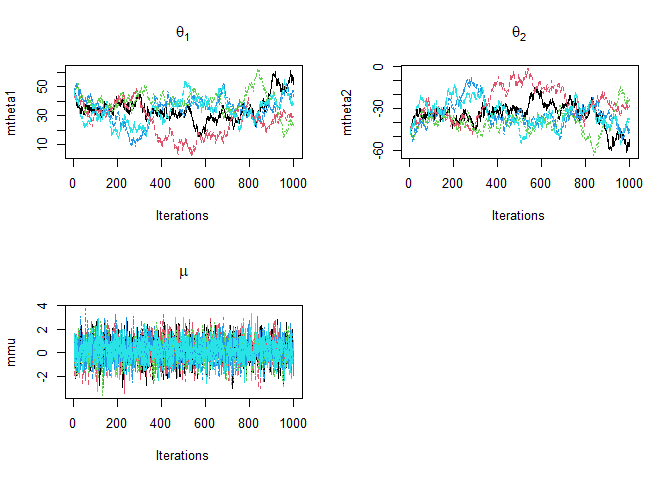

# conjugate

*p*(*θ*\|*y*) ∈ 𝒫 for all *p*(⋅\|*θ*) ∈ ℱ and *p*(⋅) ∈ 𝒫
exponential family sampling distribution ℱ
$$p(y_l\|\theta) = f(y_l) g(\theta) e^{\phi(\theta)^Tu(y_l)} \qquad p(y\|\theta) \propto \[g(\theta)\]^n e^{\phi(\theta)^Tt(y)},\mbox{ where } t(y) = \sum\limits\_{l=1}^n u(y_l)$$
conjugacy
*p*(*θ*) ∝ \[*g*(*θ*)\]<sup>*η*</sup>*e*<sup>*ϕ*(*θ*)<sup>*T*</sup>*ν*</sup>   *p*(*θ*\|*y*) ∝ \[*g*(*θ*)\]<sup>*η* + *n*</sup>*e*<sup>*ϕ*(*θ*)<sup>*T*</sup>\[*ν*+*t*(*y*)\]</sup>
$$\begin{aligned}
y_l\|\theta &\sim \mathrm{Binomial}(n,\theta)\\
\theta&\sim\mathrm{Beta}(\alpha,\beta)\\
\theta\|y&\sim\mathrm{Beta}(\alpha+y,\beta+n-y)
\end{aligned}$$

$$\begin{aligned}
y_l\|\theta &\sim \mathrm{Poisson}(\theta)\\
\theta&\sim\mathrm{Gamma}(\alpha,\beta)\\
\theta\|y&\sim\mathrm{Gamma}(\alpha+n\bar{y},\beta+n)\\
y&\sim\mathrm{NegBin}(\alpha,\beta)\\
\mathrm{NegBin}(y\|\alpha,\beta)&=\int \mathrm{Poisson}(y\|\theta)\mathrm{Gamma}(\theta\|\alpha,\beta)d\theta
\end{aligned}$$

exposure *x*<sub>*i*</sub>
$$\begin{aligned}
y_l\|\theta &\sim \mathrm{Poisson}(x_l\theta)\\
\theta&\sim\mathrm{Gamma}(\alpha,\beta)\\
\theta\|y&\sim\mathrm{Gamma}(\alpha+n\bar{y},\beta+n\bar{x})
\end{aligned}$$

$$\begin{aligned}
y_l\|\theta &\sim \mathrm{Exp}(\theta)\\
\theta&\sim\mathrm{Gamma}(\alpha,\beta)\\
\theta\|y&\sim\mathrm{Gamma}(\alpha+1,\beta+n\bar{y})
\end{aligned}$$

# noninformative

Jeffreys’ invariance principle
$p(\theta)\propto \[J(\theta)\]^{1/2} = \[J(\phi)\]^{1/2} \left\|\frac{d\phi}{d\theta}\right\|$

pivotal quantities

-   location *p*(*y*−*θ*\|*θ*) = *f*(*u*), *u* = *y* − *θ*,
    *f*(*u*) = *p*(*y*−*θ*\|*y*) ∝ *p*(*θ*)*p*(*y*−*θ*\|*θ*) = *p*(*θ*)*f*(*u*) ⇒ *p*(*θ*)∝
    constant

-   scale $p\left(\frac{y}{\theta}\Big\|\theta\right) = g(u)$,
    $u=\frac{y}{\theta}$,
    $\frac{1}{\theta}g(u)=p\left(\frac{y}{\theta}\Big\|y\right)\propto p(\theta)p\left(\frac{y}{\theta}\Big\|\theta\right)=p(\theta)\frac{y}{\theta^2}g(u) \Longrightarrow p(\theta) \propto \frac{1}{\theta}$

# asymptotics at posterior mode

$$\begin{aligned}
y\|\mu,\sigma^2 &\sim \mathrm{Normal}(\mu,\sigma^2) \\
p(\mu,\log(\sigma))&\propto \mbox{ constant}\\
(\mu,\log(\sigma))&\overset{\cdot}{\sim}\mathrm{normal}\left(\begin{bmatrix}\bar{y}\\\log(s\sqrt{(n-1)/n})\end{bmatrix}, \begin{bmatrix}(n-1)s^2/n^2 & 0\\0& 1/(2n)\end{bmatrix} \right)
\end{aligned}
$$
counterexamples

-   underidentified models and nonidentified parameters

-   number of parameters incresasing with sample size

-   aliasing

-   unbounded likelihoods

-   improper posterior distributions

-   prior distributions that excludes the point of convergence

-   convergence to the edge of parameter space

-   tails of the distribution

# hierarchical model

$$\begin{aligned}
y\_{ij}\|\theta_j &\sim \mathrm{normal}(\theta_j,\sigma^2) \quad i=1,2,\dots,n_j;j=1,2,\dots,J\\
\bar{y}\_{.j}\|\theta_j &\sim \mathrm{normal}(\theta_j,\sigma_j^2) \quad  \bar{y}\_{.j} = \frac{1}{n_j}\sum\_{i=1}^{n_j}y\_{ij}, \sigma_j^2=\sigma^2/n_j, \bar{y}\_{.j} = \frac{\sum\_{j=1}^{J}\bar{y}\_{.j}/\sigma_j^2}{\sum\_{j=1}^{J}1/\sigma_j^2}\\
p(\theta\|\mu,\tau) &= \prod\_{j=1}^J \mathrm{dnorm}(\theta_j\|\mu,\tau^2)\\
p(\mu,\tau) &\propto p(\tau)\\
p(\theta,\mu,\tau\|y) &\propto p(\mu,\tau)p(\theta\|\mu,\tau)p(y\|\theta)\\
&\propto p(\mu,\tau)\prod\_{j=1}^J \mathrm{dnorm}(\theta_j\|\mu,\tau^2)\prod\_{j=1}^J \mathrm{dnorm}(\bar{y}\_{.j}\|\theta_j,\sigma_j^2)\\
\theta_j\|\mu,\tau,y &\sim \mathrm{normal}(\hat{\theta}\_j,V_j) \quad \hat{\theta}\_j = \frac{\bar{y}\_{.j}/\sigma_j^2+\mu/\tau^2}{1/\sigma_j^2+1/\tau^2}, V_j=\frac{1}{1/\sigma_j^2+1/\tau^2}\\
\bar{y}\_{.j}\|\mu,\tau &\sim \mathrm{normal}(\mu,\sigma_j^2+\tau^2)\\
p(\mu,\tau\|y) &\propto p(\mu,\tau)\prod\_{j=1}^J \mathrm{dnorm}(\bar{y}\_{.j}\|\mu,\sigma_j^2+\tau^2)\\
\mu\|\tau,y &\sim \mathrm{normal}(\hat{\mu}\_j,V\_{\mu}) \quad \hat{\mu} = \frac{\sum\_{j=1}^J\bar{y}\_{.j}/(\sigma_j^2+\tau^2)}{\sum\_{j=1}^J1/(\sigma_j^2+\tau^2)}, V\_{\mu}^{-1}=\frac{1}{\sum\_{j=1}^J1/(\sigma_j^2+\tau^2)}\\
p(\tau\|y) &= \frac{p(\mu,\tau\|y)}{p(\mu\|\tau,y)} \\
&\propto \frac{p(\tau)\prod\_{j=1}^J \mathrm{dnorm}(\bar{y}\_{.j}\|\mu,\sigma_j^2+\tau^2)}{p(\mu\|\mu,V\_{\mu})} \\
&\propto \frac{p(\tau)\prod\_{j=1}^J \mathrm{dnorm}(\bar{y}\_{.j}\|\hat{\mu},\sigma_j^2+\tau^2)}{p(\hat{\mu}\|\hat{\mu},V\_{\mu})} \\
&\propto p(\tau)V\_{\mu}^{1/2}\prod\_{j=1}^J (\sigma_j^2+\tau^2)^{-1/2}\exp\left(-\frac{(\bar{y}\_{.j}-\hat{\mu})^2}{2(\sigma_j^2+\tau^2)}\right) \\
\end{aligned}$$

# mixture (identifiability issue)

*X* ∼ normal(*θ*<sub>1</sub>+*θ*<sub>2</sub>,1),  *θ*<sub>1</sub> ∼ normal(*μ*<sub>1</sub>,*τ*<sub>1</sub><sup>2</sup>)  ⊥ *θ*<sub>2</sub> ∼ normal(*μ*<sub>2</sub>,*τ*<sub>2</sub><sup>2</sup>)

$$\begin{aligned}
\theta_1\|\theta_2,x & \sim  \mathrm{normal}\left(\frac{\mu_1/\tau_1^2 + x-\theta_2}{1/\tau_1^2+1},\frac{1}{1/\tau_1^2+1}\right) \\
\theta_2\|\theta_1,x & \sim  \mathrm{normal}\left(\frac{\mu_2/\tau_2^2 + x-\theta_1}{1/\tau_2^2+1},\frac{1}{1/\tau_2^2+1}\right)
\end{aligned}$$

$$\begin{aligned}
p(\theta_1\|x) &\propto \int p(x\|\theta_1,\theta_2) p(\theta_1)p(\theta_2) d\theta_2\\
&\propto \exp\Bigg(-\frac{\theta_1^2 - 2\mu_1\theta_1}{2\tau_1^2}\Bigg)
\exp\Bigg(-\frac{\theta_1^2-2x\theta_1}{2}\Bigg) \int \exp\Bigg(-\frac{\theta_2^2-2(x-\theta_1)\theta_2}{2}\Bigg)
\exp\Bigg(-\frac{\theta_2^2 - 2\mu_2\theta_2}{2\tau_2^2}\Bigg)d\theta_2\\
&\propto \exp\Bigg(-\frac{\theta_1^2 - 2\mu_1\theta_1}{2\tau_1^2}\Bigg)
\exp\Bigg(-\frac{\theta_1^2-2x\theta_1}{2}\Bigg) \int \exp\Bigg(-\frac{1}{2}(1+1/\tau_2^2)\theta_2^2 + (x-\theta_1+\mu_2/\tau_2^2)\theta_2\Bigg)d\theta_2\\
&\propto \exp\Bigg(-\frac{\theta_1^2 - 2\mu_1\theta_1}{2\tau_1^2}\Bigg)
\exp\Bigg(-\frac{\theta_1^2-2x\theta_1}{2}\Bigg) \exp\Bigg(\frac{1}{2(1+1/\tau_2^2)}(x-\theta_1+\mu_2/\tau_2^2)^2\Bigg)\\
&\propto \exp\Bigg(-\frac{1}{2}\[1+1/\tau_1^2-1/(1+1/\tau_2^2)\]\theta_1^2 + \[x + \mu_1/\tau_1^2 - (x+\mu_2/\tau_2^2)/(1+1/\tau_2^2)\]\theta_1\Bigg)\\
\theta_1\|x&\sim \mathrm{normal}\left(\frac{x + \mu_1/\tau_1^2 - (x+\mu_2/\tau_2^2)/(1+1/\tau_2^2)}{1+1/\tau_1^2-1/(1+1/\tau_2^2)},\frac{1}{1+1/\tau_1^2-1/(1+1/\tau_2^2)}\right)\\
&\sim \mathrm{normal}\left(\frac{\tau_1^2(x - \mu_2) + (1+\tau_2^2)\mu_1}{1+\tau_1^2+\tau_2^2},\frac{\tau_1^2(1+\tau_2^2)}{1+\tau_1^2+\tau_2^2}\right)\\
&\sim \mathrm{normal}\left(\frac{\mu_1/\tau_1^2 + (x - \mu_2)/(1+\tau_2^2)}{1/\tau_1^2+1/(1+\tau_2^2)},\frac{1}{1/\tau_1^2+1/(1+\tau_2^2)}\right)\\
\theta_2\|x&\sim \mathrm{normal}\left(\frac{\mu_2/\tau_2^2 + (x - \mu_1)/(1+\tau_1^2)}{1/\tau_2^2+1/(1+\tau_1^2)},\frac{1}{1/\tau_2^2+1/(1+\tau_1^2)}\right)
\end{aligned}$$

``` r
> a1 <- 50; a2 <- 50
> b1 <- 10; b2 <- 20
> y <- 0; S <- 1000
> mtheta1  <-  matrix(nrow = S, ncol = 5)
> mtheta2  <-  matrix(nrow = S, ncol = 5)
> mtheta1[1,1] <- 45
> 
> set.seed(1)
> 
> for (r in 1:5) {
+   for(i in 1:S){
+     if (i == 1) {
+       theta1 <- 45
+     } else {
+       theta1 <- mtheta1[i-1,r]
+     }
+     m2 <- (b2^2*(y-theta1)+a2)/(b2^2+1)
+     sigma2 <- sqrt(b2^2/(b2^2+1))
+     mtheta2[i,r] <- rnorm(1,m2,sigma2)
+     
+     theta2 <- mtheta2[i,r]
+     m1 <- (b1^2*(y-theta2)+a1)/(b1^2+1)
+     sigma1 <- sqrt(b1^2/(b1^2+1))
+     mtheta1[i,r] <- rnorm(1,m1,sigma1)
+   }
+ }
> 
> 
> mmu <- mtheta1 + mtheta2
> 
> 
> par(mfrow = c(2,2))
> matplot(mtheta1, type = "l", xlab = "Iterations", main = expression(theta[1]))
> matplot(mtheta2, type = "l", xlab = "Iterations", main = expression(theta[2]))
> matplot(mmu, type = "l", xlab = "Iterations", main = expression(mu))
> colMeans(mmu)
```

    [1] 0.1717898 0.2206262 0.1363345 0.1694827 0.1761298



# measures of predictive accuracy

$$\begin{aligned}
\mbox{elpd} &= \mbox{expected log predictive density for a new data point}\\
&= \mathrm{E}\_f(\log p\_{\mathrm{post}}(\tilde{y}\_i)) = \int (\log p\_{\mathrm{post}}(\tilde{y}\_i))f(\tilde{y}\_i)d\tilde{y}\_i\\
\mbox{elppd} &= \mbox{expected log pointwise predictive density for a new dataset}\\
&= \sum\_{i=1}^n \mathrm{E}\_f(\log p\_{\mathrm{post}}(\tilde{y}\_i)) \\
\mbox{lppd} &= \mbox{log pointwise predictive density}\\
&= \log\prod\_{i=1}^n p\_{\mathrm{post}}(y_i) = \sum\_{i=1}^n \log \int p(y_i\|\theta)p\_{\mathrm{post}}(\theta)d\theta \\
\mbox{computed lppd} &= \mbox{computed log pointwise predictive density}\\
&= \sum\_{i=1}^n \log \left( \frac{1}{S} \sum\_{s=1}^S  p(y_i\|\theta^s) \right)
\end{aligned}
$$

Akaike information criterion (AIC)

$$\begin{aligned}
\widehat{\mathrm{elpd}}\_{\mathrm{AIC}} &= \log p(y\|\hat{\theta}\_{\mathrm{mle}}) - k \\
\mathrm{AIC} &= -2\log p(y\|\hat{\theta}\_{\mathrm{mle}}) + 2k 
\end{aligned}$$

Deviance information criterion (DIC)

$$\begin{aligned}
\widehat{\mathrm{elpd}}\_{\mathrm{DIC}} &= \log p(y\|\hat{\theta}\_{\mathrm{Bayes}}) - p\_{\mathrm{DIC}} \\
p\_{\mathrm{DIC}} &= 2 \Bigg(\log p(y\|\hat{\theta}\_{\mathrm{Bayes}}) - \mathrm{E}\_{\mathrm{post}}(\log p(y\|\theta))\Bigg) \\
\mbox{computed } p\_{\mathrm{DIC}} &= 2 \Bigg(\log p(y\|\hat{\theta}\_{\mathrm{Bayes}}) - \frac{1}{S} \sum\_{s=1}^S \log p(y\|\theta^s) \Bigg) \\
p\_{\mathrm{DIC}\_\mathrm{alt}} &= 2 \mathrm{var}\_{\mathrm{post}}(\log p(y\|\theta))) \\
\mathrm{DIC} &= -2\log p(y\|\hat{\theta}\_{\mathrm{Bayes}}) + 2p\_{\mathrm{DIC}} 
\end{aligned}$$

Watanabe-Akaike or widely applicable information criterion (WAIC)

$$\begin{aligned}
p\_{\mathrm{WAIC}\_1} &= 2 \sum\_{i=1}^n \Bigg(\log (\mathrm{E}\_{\mathrm{post}} p(y_i\|\theta)) - \mathrm{E}\_{\mathrm{post}}(\log p(y_i\|\theta)) \Bigg) \\
\mbox{computed } p\_{\mathrm{WAIC}\_1} &= 2 \sum\_{i=1}^n  \Bigg(\log \Bigg(\frac{1}{S} \sum\_{s=1}^S \log p(y_i\|\theta^s) \Bigg) - \frac{1}{S} \sum\_{s=1}^S \log p(y_i\|\theta^s) \Bigg) \\
p\_{\mathrm{WAIC}\_2} &= \sum\_{i=1}^n \mathrm{var}\_{\mathrm{post}}(\log p(y_i\|\theta)) \\
\mbox{computed } p\_{\mathrm{WAIC}\_2} &= \sum\_{i=1}^n \widehat{\mathrm{var}}\_{\mathrm{post}}(\log p(y_i\|\theta^s)) \\
\widehat{\mathrm{elppd}}\_{\mathrm{WAIC}} &= \mathrm{lppd} - p\_{\mathrm{WAIC}} \\
\mathrm{WAIC} &= -2\mathrm{lppd} + 2p\_{\mathrm{WAIC}\_2} 
\end{aligned}$$

\`Bayesian’ information criterion (BIC)
BIC =  − 2log *p*(*y*\|*θ̂*) + *k*log *n*

Leave-one-out cross-validation
$$\begin{aligned}
\mbox{lppd}\_{\mbox{loo-cv}} &= \sum\_{i=1}^n \log p\_{\mbox{post}(-i)}(y_i) \quad\mbox{Bayesian LOO-CV estimate of out of sample predictive fit}\\
b &= \mbox{lppd} - \overline{\mbox{lppd}}\_{-i} \quad\mbox{first order bias correction}\\
\mbox{lppd}\_{\mbox{cloo-cv}} &= \mbox{lppd}\_{\mbox{loo-cv}} + b \quad\mbox{bias-corrected Bayesian LOO-CV}\\
p\_{\mbox{loo-cv}} &= \mbox{lppd} - \mbox{lppd}\_{\mbox{loo-cv}} \quad\mbox{effective number of parameters}\\
p\_{\mbox{cloo-cv}} &= \mbox{lppd} - \mbox{lppd}\_{\mbox{cloo-cv}} = \overline{\mbox{lppd}}\_{-i} - \mbox{lppd}\_{\mbox{loo-cv}} 
\end{aligned}$$

# missing data

sampling model and missing-data model
*p*(*y*<sub>obs</sub>,*I*\|*x*,*θ*,*ϕ*) = ∫*p*(*y*,*I*\|*x*,*θ*,*ϕ*)*d**y*<sub>mis</sub>

posterior
*p*(*θ*,*ϕ*\|*x*,*y*<sub>obs</sub>,*I*) ∝ *p*(*θ*,*ϕ*\|*x*)∫*p*(*y*\|*x*,*θ*)*p*(*I*\|*x*,*θ*,*ϕ*)*d**y*<sub>mis</sub>

-   superpopulation inference *p*(*θ*,*ϕ*\|*x*,*y*<sub>obs</sub>,*I*)
-   finite-population inference
    *p*(*y*<sub>mis</sub>\|*x*,*y*<sub>obs</sub>,*I*,*θ*,*ϕ*)
-   multiple imputations
    *p*(*y*<sub>mis<sub>*i*</sub></sub>\|*x*,*y*<sub>obs</sub>,*I*,*θ̂*<sub>*i*</sub>,*ϕ̂*<sub>*i*</sub>)

Ignorability
*p*(*θ*\|*x*,*y*<sub>obs</sub>,*I*) = *p*(*θ*\|*x*,*y*<sub>obs</sub>) ∝ *p*(*θ*\|*x*)∫*p*(*y*\|*x*,*θ*)*d**y*<sub>mis</sub>
 - missing at random
*p*(*I*\|*x*,*y*,*ϕ*) = *p*(*I*\|*x*,*y*<sub>obs</sub>,*ϕ*) free of
*y*<sub>mis</sub> - distinct parameters
*p*(*ϕ*\|*x*,*θ*) = *p*(*ϕ*\|*x*)

ignorable and known designs with no covariates - simple random sampling
and completely randomized experiments *p*(*I*\|*x*,*y*,*ϕ*) = *p*(*I*)

ignorable and known designs given covariates - stratified sampling and
randomized block experiments.

strongly ignorable and known designs
*p*(*I*\|*x*,*y*,*ϕ*) = *p*(*I*\|*x*)

ignorable and unknown designs - experiments with nonrandom treatment
assignments based on fully observed covariates

nonignorable and known designs - censoring at an known point

nonignorable and unknown designs - censoring at an unknown point

propensity score *P*(*I*<sub>*i*</sub>\|*X*) = *π*<sub>*i*</sub>

# multiple imputation

parameter estimate *θ̂*<sub>*k*</sub> and associated variance estimate
*Ŵ*<sub>*k*</sub> from *K* imputed data sets

$$\begin{aligned}
&\mbox{combined estimate } \bar{\theta}\_K = \frac{1}{K}\sum\_{k=1}^K \hat{\theta}\_k \\
&\mbox{total variance associated with } T_K = W_K + \frac{K+1}{K} B_K\\
&\mbox{within-imputation variance component } W_K = \frac{1}{K}\sum\_{k=1}^K \widehat{W}\_k \\
&\mbox{between-imputation variance component } B_K = \frac{1}{K-1} \sum\_{k=1}^K (\hat{\theta}\_k - \bar{\theta}\_K)^2 \\
&t\mbox{ distribution approximation with d.f. }=(K-1)\left( 1+ \frac{K}{K+1} \frac{W_K}{B_K} \right)^2 
\end{aligned}$$

# linear regression

semiconjugate prior distribution

$$
\begin{aligned}
y\|X,\beta,\sigma^2 &\sim \mbox{normal}(X\beta,\sigma^2) \propto \exp(-\mbox{SSR}(\beta)/(2\sigma^2))  \\
\beta &\sim \mbox{normal}(\beta_0, \Sigma_0)\\
\beta\|y,X,\sigma^2 &\sim \mbox{normal}(\mathbf{m}, \mathbf{V})\\
\mathbf{m}=\mbox{E}\[\beta\|y,X,\sigma^2\] &= (\Sigma_0^{-1} + X^TX/\sigma^2)^{-1} (\Sigma_0^{-1}\beta_0 + X^Ty/\sigma^2)\\
\mathbf{V} =\mbox{Var}(\beta\|y,X,\sigma^2) &= (\Sigma_0^{-1} + X^TX/\sigma^2)^{-1}
\end{aligned}
$$

$$\begin{aligned}
\gamma = 1/\sigma^2 &\sim \mbox{gamma}(\nu_0/2, \nu_0\sigma_0^2/2)\\
\gamma\|y,X,\beta &\sim \mbox{gamma}((\nu_0+n)/2, \[\nu_0\sigma_0^2+\mbox{SSR}(\beta)\]/2)\\
\sigma^2\|y,X,\beta &\sim \mbox{inverse-gamma}((\nu_0+n)/2, \[\nu_0\sigma_0^2+\mbox{SSR}(\beta)\]/2)
\end{aligned}$$

*β*<sup>(*s*)</sup> ∼ normal(**m**<sup>(*s*−1)</sup>,**V**<sup>(*s*−1)</sup>) → SSR(*β*<sup>(*s*)</sup>) → *σ*<sup>2(*s*)</sup> ∼ inverse-gamma((*ν*<sub>0</sub>+*n*)/2,\[*ν*<sub>0</sub>*σ*<sub>0</sub><sup>2</sup>+SSR(*β*<sup>(*s*)</sup>)\]/2) → (**m**<sup>(*s*)</sup>,**V**<sup>(*s*)</sup>)
 - unit information prior (Kass and Wasserman, 1995)
*Σ*<sub>0</sub><sup>−1</sup> = (*X*<sup>*T*</sup>*X*)/(*n**σ*<sup>2</sup>),
*β*<sub>0</sub> = *β̂*<sub>ols</sub>

-   *g*-prior (Zellner, 1986)
    *Σ*<sub>0</sub> = *k*(*X*<sup>*T*</sup>*X*)<sup>−1</sup> = (*g**σ*<sup>2</sup>)(*X*<sup>*T*</sup>*X*)<sup>−1</sup>,
    *β*<sub>0</sub> = 0
    $$
    \begin{aligned}
    \mathbf{m} &= (X^TX/(g\sigma^2) + X^TX/\sigma^2)^{-1} (0  + X^Ty/\sigma^2)  = \frac{g}{g+1}\sigma^2(X^TX)^{-1}X^Ty\\
    \mathbf{V}  &= (X^TX/(g\sigma^2) + X^TX/\sigma^2)^{-1} = \frac{g}{g+1}\sigma^2(X^TX)^{-1}\\
    \sigma^2\|y,X &\sim \mbox{inverse-gamma}((\nu_0+n)/2, \[\nu_0\sigma_0^2+\mbox{SSR}\_g\]/2)\\
    \mbox{SSR}\_g &= y^Ty - \mathbf{m}^T\mathbf{V}^{-1}\mathbf{m} = y^T(\mathbf{I} - \frac{g}{g+1}X(X^TX)^{-1}X^T)y
    \end{aligned}
    $$

# Gaussian process regression

-   a Gaussian process *μ* ∼ GP(*m*,*k*) with a mean function *m* and
    covariance function *k*
    (*μ*(*x*<sub>1</sub>),…,*μ*(*x*<sub>*n*</sub>)) ∼ *N*<sub>*n*</sub>((*m*(*x*<sub>1</sub>),…,*m*(*x*<sub>*n*</sub>)),*K*(*x*<sub>1</sub>,…,*x*<sub>*n*</sub>))

-   a common choice of covariance function
    *k*(*x*,*x*′) = *τ*<sup>2</sup>exp (−\|*x*−*x*′\|<sup>2</sup>/(2*l*<sup>2</sup>))

-   observe (*x*<sub>*i*</sub>,*y*<sub>*i*</sub>) and predict *μ*(*x̃*)
 
    $$\begin{aligned}
    \mbox{observation model } y_i &\sim N(\mu_i, \sigma^2) \\
    \mbox{prior } \mu&\sim\mbox{GP(0,k)}\\
    \begin{pmatrix} y \\ \tilde{\mu} \end{pmatrix} &\sim N\left( \begin{pmatrix} 0 \\ 0 \end{pmatrix}, \begin{pmatrix} K(x,x) + \sigma^2I & K(\tilde{x},x) \\K(x,\tilde{x}) & K(\tilde{x},\tilde{x}) \end{pmatrix} \right)\\
    \mbox{posterior } \tilde{\mu}\|x,y,\tau,l,\sigma &\sim N(\mbox{E}\[\tilde{\mu}\], \mbox{Cov}(\tilde{\mu}))\\
    \mbox{E}\[\tilde{\mu}\]&= K(\tilde{x},x) (K(x,x) + \sigma^2I)^{-1}y\\
    \mbox{Cov}(\tilde{\mu}) &= K(\tilde{x},\tilde{x}) - K(\tilde{x},x) (K(x,x) + \sigma^2I)^{-1}K(x,\tilde{x})
    \end{aligned}$$

-   a connection to basis expansion
    $\mu(x) = \sum\_{h=1}^H \beta_h b_h(x)$,
    *β* = (*β*<sub>1</sub>,…,*β*<sub>*H*</sub>) ∼ *N*<sub>*H*</sub>(*β*<sub>0</sub>,*Σ*<sub>*β*</sub>)
    
    $$\begin{aligned}
    (\mu(x_1),\dots,\mu(x_n)) &\sim N_n((m(x_1),\dots,m(x_n)), K(x_1,\dots,x_n))\\
    \mbox{mean function } m(x) &= b(x)^T\beta_0\\
    \mbox{covariance function } k(x,x') &= b(x)^T\Sigma\_{\beta}b(x')
    \end{aligned}$$

# Dirichlet process

-   Bayesian histogram for $y_i\overset{i.i.d.}{\sim}f$ with
    prespecified knots *ξ* = (*ξ*<sub>0</sub>,…,*ξ*<sub>*K*</sub>),
    *ξ*<sub>0</sub> \< *ξ*<sub>1</sub> \< … \< *ξ*<sub>*K*</sub>,
    *y*<sub>*i*</sub> ∈ \[*ξ*<sub>0</sub>,*ξ*<sub>*K*</sub>\]
    
    $$\begin{aligned}
    f(y) &= \sum\_{k=1}^K I(\xi\_{k-1}\<y\le\xi_k) \frac{\pi_k}{\xi_k-\xi\_{k-1}} \\
    \mbox{prior } p(\pi\|a) &= \frac{\Gamma(\sum\_{k=1}^Ka_k)}{\prod\_{k=1}^K\Gamma(a_k)}\prod\_{k=1}^K \pi_k^{a_k-1}\\
    \mbox{posterior } \pi\|y &\sim \mbox{Dirichlet}(a_1+n_1,\dots,a_K+n_K),\quad n_k=\sum_iI(\xi\_{k-1}\<y_i\le \xi_k)
    \end{aligned}$$

-   a random probability measure *P* over (*Ω*,ℬ) assigned a Dirichlet
    process DP(*α**P*<sub>0</sub>).

    -   (indirect representation) For finite
        *B*<sub>1</sub>, …, *B*<sub>*K*</sub> partitioning *Ω*,
        (*P*(*B*<sub>1</sub>),…,*P*(*B*<sub>*K*</sub>)) ∼ Dirichlet(*α**P*<sub>0</sub>(*B*<sub>1</sub>),…,*α**P*<sub>0</sub>(*B*<sub>*K*</sub>))
    -   (direct representation) stick-breaking construction
    
        $$P(\cdot) = \sum\_{k=1}^{\infty} \pi_k \delta\_{\theta_k}(\cdot),\quad \pi_k=V_k\prod\_{l\<k}(1-V_l), \quad V_k\sim \mbox{Beta}(1,\alpha),\quad \theta_k\sim P_0$$
        
        $$\begin{aligned}
        \mbox{observation model } y_i &\overset{i.i.d.}{\sim} P \\
        \mbox{prior } P &\sim \mbox{DP}(\alpha P_0)\\
        \mbox{E}\[P(B)\] &= P_0(B), \mbox{ for all }B\in \mathcal{B}\\ 
        \mbox{Var}\[P(B)\] &= \frac{P_0(B)(1-P_0(B))}{1+\alpha}, \mbox{ for all }B\in \mathcal{B}\\ 
        \mbox{posterior } P\|y_1,\dots,y_n &\sim \mbox{DP}(\alpha P_0 + \sum\_{i=1}^n\delta\_{yi})\\
        (P(B_1),\dots,P(B_K))\|y_1,\dots,y_n &\sim \mbox{Dirichlet}(\alpha P_0(B_1) + \sum\_{i=1}^nI(y_i\in B_1), \dots, \alpha P_0(B_K) + \sum\_{i=1}^nI(y_i\in B_K)) \\
        \mbox{E}\[P(B)\|y_1,\dots,y_n\] &= \frac{\alpha}{\alpha + n}P_0(B) + \frac{n}{\alpha + n}\sum\_{i=1}^n\frac{1}{n}\delta\_{y_i}(B)\\
        \alpha\to 0,\quad P\|y_1,\dots,y_n &\sim \mbox{DP}(\sum\_{i=1}^n\delta\_{y_i})\quad\mbox{Bayesian bootstrap}
        \end{aligned}$$

-   DP mixture model
    $f(y) = \sum\_{k=1}^{\infty} \pi_k \mathcal{K}(y\|\theta_k^\*)$ with
    *π* ∼ DP(*α**P*<sub>0</sub>)

    $$\begin{aligned}
    y_i &\sim \mathcal{K}(\theta_i)\\
    \theta_i &\sim P\\
    P &\sim \mbox{DP}(\alpha P_0)\\
    \mbox{Polya urn } \theta_i\|\theta\_{-i} &\sim \frac{\alpha}{\alpha+i-1} P_0(\theta_i) + \sum\_{j=1}^{i-1} \frac{1}{\alpha + i-1}\delta\_{\theta_j} \\
    \mbox{posterior } \theta_i\|\theta^{(-i)} &\sim \frac{\alpha}{\alpha+n-1} P_0(\theta_i) + \sum\_{k=1}^{K^{(-i)}} \frac{n_k^{(-i)}}{\alpha + n-1}\delta\_{\theta_k^{\*(-i)}},\quad \theta_k^{\*(-i)} \mbox{ are unique values of }\theta^{(-i)}, \quad n_k^{(-i)}=\sum\_{j\ne i}I(\theta_j=\theta_k^\*)
    \end{aligned}$$
