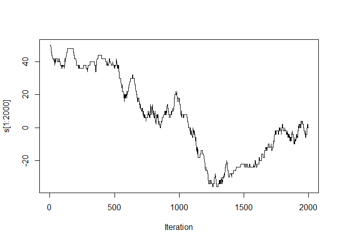
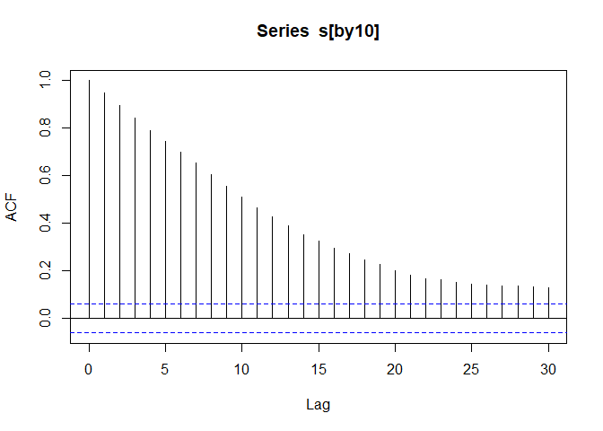
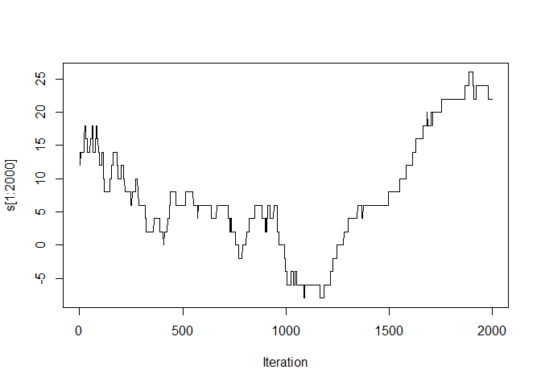
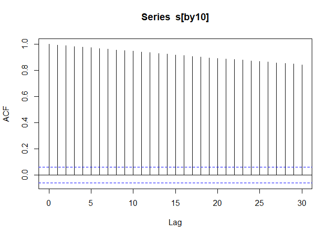

Boltzmann distribution (Gibbs distribution)
$\pi(\mathbf{x}) = \frac{1}{Z}e^{-\frac{U(\mathbf{x})}{kT}}$

-   configuration of a physical system **x**
-   potential energy *U*(**x**)
-   temperature *T*
-   Boltzmann constant *k*
-   partition function *Z* = *Z*(*T*)
-   internal energy ⟨*U*⟩ = 𝔼<sub>*π*</sub>{*U*(**x**)}
-   set $\beta = \frac{1}{kT}$,
    $\frac{\partial \log(Z)}{\partial \beta}= - \langle U\rangle$
-   free energy *F* =  − *k**T*log (*Z*)
-   specific heat of the system
    $C = \frac{\partial \langle U\rangle}{\partial T}       =\frac{1}{kT^2}\mathrm{Var}\_{\pi}\\U(\mathbf{x})\\$
-   the system’s entropy *S* = (⟨*U*⟩−*F*)/*T*

2-*D* Ising model on a *N* × *N* lattice space
ℒ = {(*i*,*j*), *i*, *j* = 1, …, *N*}

*U*(**x**) =  − *J*∑<sub>*σ* ∼ *σ*′</sub>*x*<sub>*σ*</sub>*x*<sub>*σ*′</sub> + ∑<sub>*σ*</sub>*h*<sub>*σ*</sub>(*x*<sub>*σ*</sub>)

-   configuration of the whole system **x**= { *x*<sub>*σ*</sub>:
    *σ* ∈ ℒ }
-   a particle at site *σ* has either a positive or a negative spin
    *x*<sub>*σ*</sub> ∈ { + 1,  − 1}  
-   sites *σ*, *σ*′ ∈ ℒ are a neighboring pair *σ* ∼ *σ*′
-   interaction strength *J*
-   external magnetic field *h*<sub>*σ*</sub>
-   mean magnetization per spin
    $\langle m\rangle = \mathbb{E}\_{\pi}\\\frac{1}{N^2}\left\|\sum\_{\sigma\in S}x\_{\sigma}\right\|\\$

Potts model *x*<sub>*l*</sub> ∈ {1, 2, …, *q*},
*H*(**x**) =  − *J*∑<sub>*i* ∼ *j*</sub>*δ*<sub>*x*<sub>*i*</sub>*x*<sub>*j*</sub></sub> − ∑<sub>*j*</sub>*h*<sub>*j*</sub>(*x*<sub>*j*</sub>)

-   *q* = 2,
    $H(\mathbf{x})=-\frac{1}{2}J\sum\_{i\sim j}2\left(\delta\_{x_ix_j}-\frac{1}{2}\right) -\sum_jh_j(x_j)$

simple liquid model
**x** = {*x*<sub>*i*</sub> ∈ ℝ<sup>3</sup> : *i* = 1, …, *k*} ∈ ℝ<sup>3*k*</sup>

-   energy
    *U*(**x**) = ∑<sub>*i*, *j*</sub>*Φ*(\|*x*<sub>*i*</sub>−*x*<sub>*j*</sub>\|) = ∑<sub>*i*, *j*</sub>*Φ*(*r*<sub>*i**j*</sub>)
-   Lennard-Jobes pair potential
    $\Phi(r) = 4\epsilon\left\[\left(\frac{\sigma}{r}\right)^{12} -\left(\frac{\sigma}{r}\right)^{6} \right\]$

macromolecules model

-   energy
    $U(\mathbf{x}) = \sum\_{\mbox{bonds}}\\\mbox{bond terms}\\ + \sum\_{i,j}\left\[\Phi(r\_{ij}) + \frac{q_iq_j}{4\pi\epsilon_0r\_{ij}}\right\]$
-   bond terms
    $=\sum\_{\mbox{bonds}} \frac{k_i}{2}(l_i-l\_{i,0})^2 + \sum\_{\mbox{angles}} \frac{k_i}{2}(\theta_i-\theta\_{i,0})^2 + \sum\_{\mbox{torsions}} v(\omega_i)$
-   bond length *l*<sub>*i*</sub>, bond angle *θ*<sub>*i*</sub>, torsion
    angle *ω*<sub>*i*</sub>
-   torsion term $v(\omega_i) = \frac{V_n}{2}(1+\cos(n\omega -\gamma))$

### variance reduction methods

stratified sampling

-   estimand ∫<sub>𝒳</sub>*f*(*x*)*d**x*
-   partition *D*<sub>1</sub>, …, *D*<sub>*k*</sub> of 𝒳
-   *μ̂* = *μ̂*<sub>1</sub> + … + *μ̂*<sub>*k*</sub>,
    *μ̂*<sub>*i*</sub> = *m*<sub>*i*</sub><sup>−1</sup>\[*f*(*X*<sub>*i*, 1</sub>)+…+*f*(*X*<sub>*i*, *m*<sub>*i*</sub></sub>)\]
-   $\mathrm{Var}(\hat{\mu})=\frac{\sigma_1^2}{m_1} + \dots + \frac{\sigma_k^2}{m_k}$

control variates method

-   estimand *μ* = 𝔼{*X*}
-   control variate *C* with known *μ*<sub>*C*</sub> = 𝔼{*C*}
    -   sample *X*(*b*) = *X* + *b*(*C*−*μ*<sub>*C*</sub>)
    -   Var(*X*(*b*)) = Var(*X*) + 2*b*Cov(*X*,*C*) + *b*<sup>2</sup>Var(*C*)
    -   set *b* = Cov(*X*,*C*)/Var(*C*),
        Var(*X*(*b*)) = (1−*ρ*<sub>*X**C*</sub><sup>2</sup>)Var(*X*)
-   control variate *C* with unknown 𝔼{*C*} = *μ*
    -   sample *X*(*b*) = *b**X* + (1−*b*)*C*
    -   Var(*X*(*b*)) = *b*<sup>2</sup>Var(*X*) + 2*b*(1−*b*)Cov(*X*,*C*) + (1−*b*)<sup>2</sup>Var(*C*)
    -   *b* = \[Var(*C*)−Cov(*X*,*C*)\]/\[Var(*X*)−2Cov(*X*,*C*)+Var(*C*)\]

antithetic variates method (Hammersley and Morton, 1956)

-   sample pair *X* = *F*<sup>−1</sup>(*U*),
    *X*′ = *F*<sup>−1</sup>(1−*U*) instead of two independent Monte
    Carlo draws for estimating 𝔼{*X*}
-   cdf *F* is monotone,
    Cov(*X*,*X*′) = 𝔼{\[*F*<sup>−1</sup>(*U*)−*F*<sup>−1</sup>(*U*′)\]\[*F*<sup>−1</sup>(1−*U*)−*F*<sup>−1</sup>(1−*U*′)\]} ≤ 0

Rao-Blackwellization (Bickel and Doksum, 2000)

-   estimand *I* = 𝔼{*h*(*X*)}
-   *X* = (*x*<sub>1</sub>,*X*<sub>2</sub>). analytic
    𝔼{*h*(*X*)\|*X*<sub>2</sub>}
-   histogram estimator $ = \_{l=1}^m h(X^{(l)})
-   mixture estimator
    $\tilde{I} = \frac{1}{m}\sum\_{l=1}^m \mathbb{E}\\h(X)\|X_2^{(l)}\\$

chain-structure model

-   $\pi(\mathbf{x}) \propto \exp\left( -\sum\_{i=1}^d h_i(x\_{i-1},x_i) \right)$
-   Markovian
    *π*(*x*<sub>*i*</sub>\|**x**<sub>−*i*</sub>) ∝ exp (−*h*<sub>*i*</sub>(*x*<sub>*i* − 1</sub>,*x*<sub>*i*</sub>)−*h*<sub>*i* + 1</sub>(*x*<sub>*i*</sub>,*x*<sub>*i* + 1</sub>))
-   hidden Markov model (HMM) when
    *x*<sub>*i*</sub> ∈ 𝒮 = {*s*<sub>1</sub>, …, *s*<sub>*k*</sub>}
-   optimization by dynamic programming *O*(*d**k*<sup>2</sup>)

$$m_1(x)=\min\limits\_{s_i\in\mathcal{S}}h_1(s_i,x),\quad m_t(x)=\min\limits\_{s_i\in\mathcal{S}}\\m\_{t-1}(s_i)+h_t(s_i,x)\\,\quad x=s_1,\dots,s_k$$

$$\hat x_1=\arg\min\limits\_{s_i\in\mathcal{S}} m_d(s_i),\quad \hat x_t=\arg\min\limits\_{s_i\in\mathcal{S}}\\m\_{t}(s_i)+h\_{t+1}(s_i,\hat x\_{t+1})\\,\quad t=d-1,\dots,1
$$

-   exact simulation
    -   partition function
        *Z* = ∑<sub>**x**</sub>exp (−*H*(**x**)) = ∑<sub>*x* ∈ 𝒮</sub>*V*<sub>*d*</sub>(*x*)

*V*<sub>1</sub>(*x*) = ∑<sub>*x*<sub>0</sub> ∈ 𝒮</sub>*e*<sup>−*h*<sub>1</sub>(*x*<sub>0</sub>,*x*)</sup>,  *V*<sub>*t*</sub>(*x*) = ∑<sub>*y* ∈ 𝒮</sub>*V*<sub>*t* − 1</sub>(*y*)*e*<sup>−*h*<sub>*t*</sub>(*y*,*x*)</sup>,  *t* = 2, …, *d*

$$x_d \sim V_d(x)/Z,\quad x_t \sim \frac{V\_{t}(x)e^{-h\_{t+1}(x,x\_{t+1})}}{\sum\_{y\in\mathcal{S}}V\_{t}(y)e^{-h\_{t+1}(y,x\_{t+1})}},\quad t=d-1,\dots,1$$

    - Ising model $\pi(\bx) = Z^{-1}\exp(\beta(x_0x_1 + \dots + x_{d-1}x_d)), \quad x_i\in \{-1,+1\}$

*V*<sub>1</sub>(*x*) = *e*<sup>*β**x*</sup> + *e*<sup>−*β**x*</sup> = *e*<sup>*β*</sup> + *e*<sup>−*β*</sup>,  *V*<sub>*t*</sub>(*x*) = (*e*<sup>*β*</sup>+*e*<sup>−*β*</sup>)<sup>*t*</sup>,  *Z* = 2(*e*<sup>*β*</sup>+*e*<sup>−*β*</sup>)<sup>*d*</sup>
 - graphical model, peeling algorithm /
forward-summation-backward-sampling method -
**x**<sub>*C*</sub> = {*x*<sub>*i*</sub>, *i* ∈ *C*}, clique
*C* ∈ 𝒞 ⊂ 2<sup>{1, …, *d*}</sup> (Lauritzen and Spiegelhalter, 1998),
connected *C*<sub>*i*</sub> ∩ *C*<sub>*j*</sub> ≠ ∅

## importance sampling

*μ* = 𝔼<sub>*π*</sub>{*h*(**x**)} = 𝔼<sub>*g*</sub>{*w*(**x**)*h*(**x**)},  *w* = *π*(**x**)/*g*(**x**)

-   normalized weight
    $\hat{\mu}= \frac{w^{(1)}h(\mathbf{x}^{(1)})+\dots+w^{(n)}h(\mathbf{x}^{(n)})}{w^{(1)}+\dots+w^{(n)}}=\frac{\overline{Z}}{\overline{W}}$
    -   know *π*(**x**)/*g*(**x**) up to a multiplicative constant
    -   often a smaller MSE than *μ̃*
-   unbiased estimate
    *μ̃* = *n*<sup>−1</sup>\[*w*<sup>(1)</sup>*h*(**x**<sup>(1)</sup>)+…+*w*<sup>(*n*)</sup>*h*(**x**<sup>(*n*)</sup>)\]
-   Effective Sample Size
    $=\frac{\mathrm{Var}\_{\pi}(\bar{\mu})}{\mathrm{Var}\_{g}(\hat{\mu})}=\frac{n}{1+\mathrm{Var}\_g(w(\mathbf{x}))}$,
    direct sample
    $\bar{\mu}=n^{-1}\[h(y^{(1)})+\dots+h(y^{(n)})\]=\overline{H}$,
    *y*<sup>(*i*)</sup> ∼ *π*

$$\begin{aligned}
  \mathrm{Var}\_g(\hat{\mu}) &=\mathrm{Var}\_g(\overline{Z}/\overline{W}) \approx \begin{bmatrix} \frac{1}{\mathbb{E}\_g\\W\\} & -\frac{\mathbb{E}\_g\\Z\\}{\mathbb{E}\_g^2\\W\\} \end{bmatrix} \frac{1}{n}\begin{bmatrix} \mathrm{Var}\_g(Z) & \mathrm{Cov}\_g(Z,W)\\ \mathrm{Cov}\_g(W,Z)   & \mathrm{Var}\_g(W)  \end{bmatrix} \begin{bmatrix} \frac{1}{\mathbb{E}\_g\\W\\} \\ -\frac{\mathbb{E}\_g\\Z\\}{\mathbb{E}\_g^2\\W\\} \end{bmatrix}\\
    &= \frac{1}{n}\left\[ \frac{\mathrm{Var}\_g(Z)}{\mathbb{E}\_g^2\\W\\} - 2 \frac{\mathbb{E}\_g\\Z\\\mathrm{Cov}\_g(Z,W)}{\mathbb{E}\_g^3\\W\\}  +\frac{\mathbb{E}\_g^2\\Z\\\mathrm{Var}\_g(W)}{\mathbb{E}\_g^4\\W\\}\right\]\\
    &= n^{-1}\[ \mathrm{Var}\_g(Z) - 2 \mu\mathrm{Cov}\_g(Z,W)  + \mu^2\mathrm{Var}\_g(W)\]\\
    &= n^{-1}\[ (\mathbb{E}\_{\pi}\\WH^2\\-\mu) - 2 \mu(\mathbb{E}\_{\pi}\\WH\\ -\mu ) + \mu^2\mathrm{Var}\_g(W)\]\\ 
    \mathbb{E}\_{\pi}\\WH^2\\&\approx \mathbb{E}\_{\pi}\\W\\\mathbb{E}\_{\pi}^2\\H\\ +\frac{1}{2} \mathrm{tr}\left(\begin{bmatrix} 0 & 2\mathbb{E}\_{\pi}\\H\\\\
    2\mathbb{E}\_{\pi}\\H\\ & 2\mathbb{E}\_{\pi}\\W\\\end{bmatrix} \begin{bmatrix} \mathrm{Var}\_{\pi}(W) & \mathrm{Cov}\_{\pi}(W,H)\\ \mathrm{Cov}\_{\pi}(H,W) & \mathrm{Var}\_{\pi}(H)  \end{bmatrix}\right) \\
    &= n^{-1}\[ (\mu^2\mathbb{E}\_{\pi}\\W\\ + 2\mu\mathrm{Cov}\_{\pi}(H,W) + \mathbb{E}\_{\pi}\\W\\\mathrm{Var}\_{\pi}(H)-\mu^2 )- 2 \mu(\mathrm{Cov}\_{\pi}(WH) + \mu\mathbb{E}\_{\pi}\\W\\ -\mu ) + \mu^2\mathrm{Var}\_{g}(W)\]\\
    &= n^{-1}\[ \mathbb{E}\_{\pi}\\W\\\mathrm{Var}\_{\pi}(H) +\mu^2(1-\mathbb{E}\_{\pi}\\W\\+\mathrm{Var}\_{g}(W))\]\\
    &= n^{-1}\[ \mathbb{E}\_{\pi}\\W\\\mathrm{Var}\_{\pi}(H) +\mu^2(1-\mathbb{E}\_{g}\\W^2\\+\mathrm{Var}\_{g}(W))\]\\
    &= n^{-1} \mathbb{E}\_{\pi}\\W\\\mathrm{Var}\_{\pi}(H)\\
    &=\frac{1+\mathrm{Var}\_g(W)}{n}\mathrm{Var}\_{\pi}(H)
\end{aligned}
$$

-   proper w.r.t *π*:
    𝔼<sub>*g*</sub>{*h*(**x**<sup>(*i*)</sup>)*w*<sup>(*i*)</sup>} = *c*𝔼<sub>*π*</sub>{*h*(**x**)},
    for all square integrable *h*(⋅) ⇔
    $\frac{\mathbb{E}\_{g}\\w\|\mathbf{x}\\}{\mathbb{E}\_{g}\\w\\}g(\mathbf{x}) = \pi(\mathbf{x})$

<!-- - missing data from a bivariate normal distribution -->
<!-- $$\begin{aligned} -->
<!-- y &\sim \mbox{N}(0,\Sigma),\quad \Sigma = \begin{bmatrix} \sigma_1^2, \rho\sigma_1\sigma_2\\ \rho\sigma_1\sigma_2 & \sigma_2^2\end{bmatrix}\\ -->
<!-- \pi(\Sigma) &\propto |\Sigma|^{-(d+1)/2}, \quad d=2\\ -->
<!-- \pi(\Sigma|y_1,\dots,y_n) &\propto |\Sigma|^{-(n+d+1)/2}\exp(-\mbox{tr}(\Sigma^{-1} S)/2)\sim\mbox{inverse Wishart}(n,S), \quad S = y^Ty\\ -->
<!-- \Sigma|\mathbf{y}_{\mbox{mis}},\mathbf{y}_{\mbox{obs}} &\sim \mbox{inverse Wishart}(n,S(\mathbf{y}_{\mbox{mis}})) \\ -->
<!-- y_{\mbox{mis}}|\Sigma,\mathbf{y}_{\mbox{obs}} &= y_{\mbox{mis}}|\Sigma,y_{\mbox{obs}}\sim \mbox{N}(\mu_*,\sigma_*),\quad \mu_*=\rho y_{\mbox{obs}} \sqrt{\sigma_{\mbox{obs}}/\sigma_{\mbox{mis}}},\sigma_*^2=(1-\rho^2)\sigma_{\mbox{obs}} \\ -->
<!-- \mbox{proposal }g:\ \Sigma &\sim \mbox{inverse Wishart}(n_{\mbox{obs}},S(\mathbf{y}_{\mbox{obs}})) -->
<!-- \end{aligned}$$ -->
<!-- ```{r misingdata, echo = FALSE} -->
<!-- library(knitr) -->
<!-- dat_mis = matrix(c(1,1,-1,-1,2,2,-2,-2,NA,NA,NA,NA,1,-1,1,-1,NA,NA,NA,NA,2,2,-2,-2),nrow = 2, byrow = T) -->
<!-- kable(as.data.frame(dat_mis), col.names = 1:dim(dat_mis)[2]) -->
<!-- ``` -->
<!-- ```{r importance sampling} -->
<!-- set.seed(123) -->
<!-- nsamp <- 5000 -->
<!-- SS_obs <- dat_mis[,1:4] %*% t(dat_mis[,1:4]) -->
<!-- dat_imp <- dat_mis -->
<!-- rho <- numeric(nsamp) -->
<!-- # weights -->
<!-- for (i in 1:nsamp) { -->
<!--   S_inv <- rWishart(1, 4, SS_obs)[,,1] -->
<!--   det_S_inv <- S_inv[1,1]*S_inv[2,2] - S_inv[1,2]*S_inv[2,1] -->
<!--   r <- -S_inv[1,2]/sqrt(S_inv[1,1]*S_inv[2,2]) -->
<!--   mu1 <- r * dat_mis[1,5:8] * sqrt(S_inv[2,2]/S_inv[1,1]) -->
<!--   mu2 <- r * dat_mis[2,9:12] * sqrt(S_inv[1,1]/S_inv[2,2]) -->
<!--   s1 <- sqrt((1-r^2) * S_inv[2,2]/det_S_inv) -->
<!--   s2 <- sqrt((1-r^2) * S_inv[1,1]/det_S_inv) -->
<!--   dat_imp[1,9] <- rnorm(1, mean = mu2[1], sd = s2) -->
<!--   dat_imp[1,10] <- rnorm(1, mean = mu2[2], sd = s2) -->
<!--   dat_imp[1,11] <- rnorm(1, mean = mu2[3], sd = s2) -->
<!--   dat_imp[1,12] <- rnorm(1, mean = mu2[4], sd = s2) -->
<!--   dat_imp[2,5] <- rnorm(1, mean = mu1[1], sd = s1) -->
<!--   dat_imp[2,6] <- rnorm(1, mean = mu1[2], sd = s1) -->
<!--   dat_imp[2,7] <- rnorm(1, mean = mu1[3], sd = s1) -->
<!--   dat_imp[2,8] <- rnorm(1, mean = mu1[4], sd = s1) -->
<!--   SS_imp <- dat_imp %*% t(dat_imp) -->
<!--   S_postr <- rWishart(1000, 12, SS_imp) -->
<!--   rho[i] <- mean(apply(S_postr, 3, function(mat){-mat[1,2]/sqrt(mat[1,1]*mat[2,2])})) -->
<!-- } -->
<!-- hist(rho, breaks = seq(-1,1,length.out = 41), freq = F, main = expression(rho)) -->
<!-- rx <- seq(-1,1,length.out = 201) -->
<!-- ry <- (1-rx^2)^(4.5)/(1.25-rx^2)^8 / integrate(function(x){(1-x^2)^(4.5)/(1.25-x^2)^8},-1,1)$value -->
<!-- lines(rx,ry) -->
<!-- ``` -->
<!-- ```{r importance sampling2} -->
<!-- set.seed(123) -->
<!-- nsamp <- 5000 -->
<!-- SS_obs <- dat_mis[,1:4] %*% t(dat_mis[,1:4]) -->
<!-- dat_imp <- dat_mis -->
<!-- rho <- numeric(nsamp) -->
<!-- # weights -->
<!-- for (i in 1:nsamp) { -->
<!--   S_inv <- rWishart(1, 4, SS_obs)[,,1] -->
<!--   det_S_inv <- S_inv[1,1]*S_inv[2,2] - S_inv[1,2]*S_inv[2,1] -->
<!--   r <- -S_inv[1,2]/sqrt(S_inv[1,1]*S_inv[2,2]) -->
<!--   mu1 <- r * dat_mis[1,5:8] * sqrt(S_inv[2,2]/S_inv[1,1]) -->
<!--   mu2 <- r * dat_mis[2,9:12] * sqrt(S_inv[1,1]/S_inv[2,2]) -->
<!--   s1 <- sqrt((1-r^2) * S_inv[2,2]/det_S_inv) -->
<!--   s2 <- sqrt((1-r^2) * S_inv[1,1]/det_S_inv) -->
<!--   dat_imp[1,9] <- rnorm(1, mean = mu2[1], sd = s2) -->
<!--   dat_imp[1,10] <- rnorm(1, mean = mu2[2], sd = s2) -->
<!--   dat_imp[1,11] <- rnorm(1, mean = mu2[3], sd = s2) -->
<!--   dat_imp[1,12] <- rnorm(1, mean = mu2[4], sd = s2) -->
<!--   dat_imp[2,5] <- rnorm(1, mean = mu1[1], sd = s1) -->
<!--   dat_imp[2,6] <- rnorm(1, mean = mu1[2], sd = s1) -->
<!--   dat_imp[2,7] <- rnorm(1, mean = mu1[3], sd = s1) -->
<!--   dat_imp[2,8] <- rnorm(1, mean = mu1[4], sd = s1) -->
<!--   SS_imp <- dat_imp %*% t(dat_imp) -->
<!--   rho[i] <- - SS_imp[1,2]/sqrt(SS_imp[1,1]*SS_imp[2,2]) -->
<!-- } -->
<!-- hist(rho, breaks = seq(-1,1,length.out = 41), freq = F, main = expression(rho)) -->
<!-- rx <- seq(-1,1,length.out = 201) -->
<!-- ry <- (1-rx^2)^(4.5)/(1.25-rx^2)^8 / integrate(function(x){(1-x^2)^(4.5)/(1.25-x^2)^8},-1,1)$value -->
<!-- lines(rx,ry) -->
<!-- ``` -->
<!-- ```{r importance sampling3} -->
<!-- set.seed(123) -->
<!-- nsamp <- 5000 -->
<!-- SS_obs <- dat_mis[,1:4] %*% t(dat_mis[,1:4]) -->
<!-- rho <- numeric(nsamp) -->
<!-- w <- numeric(nsamp) -->
<!-- SS_imp <- matrix(0, nrow = 2, ncol = 2) -->
<!-- # weights -->
<!-- for (i in 1:nsamp) { -->
<!--   S_inv <- rWishart(1, 4, SS_obs)[,,1] -->
<!--   det_S_inv <- S_inv[1,1]*S_inv[2,2] - S_inv[1,2]*S_inv[2,1] -->
<!--   r <- -S_inv[1,2]/sqrt(S_inv[1,1]*S_inv[2,2]) -->
<!--   mu1 <- r * dat_mis[1,5:8] * sqrt(S_inv[2,2]/S_inv[1,1]) -->
<!--   mu2 <- r * dat_mis[2,9:12] * sqrt(S_inv[1,1]/S_inv[2,2]) -->
<!--   s1 <- sqrt((1-r^2) * S_inv[2,2]/det_S_inv) -->
<!--   s2 <- sqrt((1-r^2) * S_inv[1,1]/det_S_inv) -->
<!--   x_1_mis <- rnorm(4, mean = mu2, sd = s2) -->
<!--   x_2_mis <- rnorm(4, mean = mu1, sd = s1) -->
<!--   SS_imp[1,1] <- sum(dat_mis[1,5:8]^2) + sum(x_1_mis^2)  -->
<!--   SS_imp[2,2] <- sum(x_2_mis^2) + sum(dat_mis[2,9:12]^2) -->
<!--   SS_imp[1,2] <- sum(dat_mis[1,5:8] * x_2_mis) + sum(x_1_mis * dat_mis[2,9:12])  -->
<!--   SS_imp[2,1] <- SS_imp[1,2] -->
<!--   SS <- SS_obs + SS_imp  -->
<!--   rho[i] <- - SS[1,2]/sqrt(SS[1,1]*SS[2,2]) -->
<!--   mu1_n <- rho[i] * dat_mis[1,5:8] * sqrt(S_inv[2,2]/S_inv[1,1]) -->
<!--   mu2_n <- rho[i] * dat_mis[2,9:12] * sqrt(S_inv[1,1]/S_inv[2,2]) -->
<!--   s1_n <- sqrt((1-rho[i]^2) * S_inv[2,2]/det_S_inv) -->
<!--   s2_n <- sqrt((1-rho[i]^2) * S_inv[1,1]/det_S_inv) -->
<!--   logw <- sum(dnorm(x_1_mis, mean = mu2_n, sd = s2_n, log = T)) + sum(dnorm(x_2_mis, mean = mu1_n, sd = s1_n, log = T)) - sum(dnorm(x_1_mis, mean = mu2, sd = s2, log = T)) - sum(dnorm(x_2_mis, mean = mu1, sd = s1, log = T)) -->
<!--   w[i] <- exp(logw) -->
<!-- } -->
<!-- var(w)/(mean(w)) -->
<!-- summary(rho) -->
<!-- hist(rho, breaks = seq(-1,1,length.out = 41), freq = F, main = expression(rho)) -->
<!-- rx <- seq(-1,1,length.out = 201) -->
<!-- ry <- (1-rx^2)^(4.5)/(1.25-rx^2)^8 / integrate(function(x){(1-x^2)^(4.5)/(1.25-x^2)^8},-1,1)$value -->
<!-- lines(rx,ry) -->
<!-- ``` -->

-   adaptive importance sampling
    -   *g*<sub>0</sub>(**x**) = *t*<sub>*α*</sub>(**x**;*μ*<sub>0</sub>,*Σ*<sub>0</sub>)
        →
        *g*<sub>1</sub>(**x**) = *t*<sub>*α*</sub>(**x**;*μ*<sub>1</sub>,*Σ*<sub>1</sub>)
    -   select *λ* = (*ϵ*,*μ*,*Σ*),
        *g*(**x**;*λ*) = *ϵ**g*<sub>0</sub>(**x**) + (1−*ϵ*)*t*<sub>*α*</sub>(**x**;*μ*,*Σ*)
-   rejection control (RC)
    -   accept **x**<sup>(*j*)</sup> with probability
        *r*<sup>(*j*)</sup> = min {1, *w*<sup>(*j*)</sup>/*c*}  
    -   if accepted, update
        *w*<sup>(\**j*)</sup> = *q*<sub>*c*</sub>*w*<sup>(*j*)</sup>/*r*<sup>(*j*)</sup>,
        *q*<sub>*c*</sub> = ∫min {1, *w*(**x**)/*c*}*g*(**x**)*d***x**
-   sequential importance sampling
    -   target density
        *π*(**x**) = *π*(*x*<sub>1</sub>)*π*(*x*<sub>2</sub>\|*x*<sub>1</sub>)…*π*(*x*<sub>*d*</sub>\|*x*<sub>1</sub>,…,*x*<sub>*d* − 1</sub>)
    -   trial density
        *g*(**x**) = *g*<sub>1</sub>(*x*<sub>1</sub>)*g*<sub>2</sub>(*x*<sub>2</sub>\|*x*<sub>1</sub>)…*g*<sub>*d*</sub>(*x*<sub>*d*</sub>\|*x*<sub>1</sub>,…,*x*<sub>*d* − 1</sub>)
    -   auxiliary distributions *π*<sub>*t*</sub>(**x**) approximate
        *π*(**x**<sub>*t*</sub>)
    -   $w_t(\mathbf{x}\_t)=w\_{t-1}(\mathbf{x}\_{t-1})\frac{\pi(x_t\|\mathbf{x}\_{t-1})}{g_t(x_t\|\mathbf{x}\_{t-1})}$,
        *w*<sub>*d*</sub>(**x**) = *w*(**x**)
    -   draw *X*<sub>*t*</sub> = *x*<sub>*t*</sub> from
        *g*<sub>*t*</sub>(*x*<sub>*t*</sub>\|**x**<sub>*t* − 1</sub>),
        *w*<sub>*t*</sub> = *w*<sub>*t* − 1</sub>*u*<sub>*t*</sub>,
        $u_t=\frac{\pi_t(\mathbf{x}\_t)}{\pi\_{t-1}(bx\_{t-1})g\_{t}(x_t\|bx\_{t-1})}$  
    -   RC in SIS, RC(*t*<sub>*k*</sub>) at check point
        0 \< *t*<sub>1</sub> \< *t*<sub>2</sub> \< … \< *t*<sub>*k*</sub> ≤ *d*
    -   growth method (inversely restricted sampling, Hammersley and
        Morton, 1954; biased sampling, Rosenbluth and Rosenbluth,
        1955)  
        Self-Avoiding random Walk model
        *π*(**x**) = *Z*<sub>*n*</sub><sup>−1</sup>  
        ℙ(*x*<sub>*t* + 1</sub>\|*x*<sub>1</sub>,…,*x*<sub>*t*</sub>) = *n*<sub>*t*</sub><sup>−1</sup>,
        *w*(**x**) = *n*<sub>1</sub> × … × *n*<sub>*N* − 1</sub> SIS.
        sampling
        *g*<sub>*t*</sub>(*x*<sub>*t*</sub>\|**x**<sub>*t* − 1</sub>) = *n*<sub>*t* − 1</sub><sup>−1</sup>,
        auxiliary
        *π*<sub>*t*</sub>(**x**<sub>*t*</sub>) = *Z*<sub>*t*</sub><sup>−1</sup>,
        marginal
        $\pi_t(\mathbf{x}\_{t-1}) = \sum\_{x_t}\pi(\mathbf{x}\_{t-1},x_t) = \frac{n\_{t-1}}{Z_t}$,
        conditional
        *π*<sub>*t*</sub>(*x*<sub>*t*</sub>\|**x**<sub>*t* − 1</sub>) = *n*<sub>*t* − 1</sub><sup>−1</sup>  
        *w*<sub>*t* + 1</sub> = *w*<sub>*t*</sub>*n*<sub>*t*</sub>,
        $w_N = \prod\_{t\ge 2} \frac{1}{g_t(x_t\|x_1,\dots,x\_{t-1})}$,
        *Ẑ*<sub>*N*</sub> = *w̄*<sup>−1</sup>
    -   sequential imputation (Kong, liu and Wong, 1994)  
        draw **y**<sub>mis</sub> from
        *g*(**y**<sub>mis</sub>) = *f*(*y*<sub>mis, 1</sub>\|*y*<sub>obs, 1</sub>,*θ*)…*f*(*y*<sub>mis, *n*</sub>\|**y**<sub>obs, *n*</sub>,**y**<sub>mis, *n* − 1</sub>,*θ*)  
        calculate weight
        *w*(**y**<sub>mis</sub>) = *f*(*y*<sub>obs, 1</sub>\|*θ*)…*f*(*y*<sub>obs, *n*</sub>\|**y**<sub>*n* − 1</sub>,*θ*)  
        $\bar{w} = \frac{1}{m}\sum\_{i=1}^m w(\mathbf{y}\_{\mbox{mis}}^{(i)}) \longrightarrow L(\theta\|\mathbf{y}\_{\mbox{obs}})$
    -   nonlinear filtering state-space model (hidden Markov model)
        $\begin{cases}\mbox{(state equation):}& x_t\sim q_t(\cdot\|x\_{t-1},\theta) \\ \mbox{(observation equation):}& y_t\sim f_t(\cdot\|x\_{t},\phi) \end{cases}$  
        Gaussian *f*<sub>*t*</sub>, *q*<sub>*t*</sub>, linear
        state-space model, Kalman filter  
        bootstrap filter (particle filter) (Gordon, Salmond and Smith,
        1993)  
        draw *x*<sub>*t* + 1</sub><sup>(\**j*)</sup> from
        *q*<sub>*t*</sub>(*x*<sub>*t* + 1</sub>\|*x*<sub>*t*</sub><sup>(*j*)</sup>),
        *w*<sup>(*j*)</sup> ∝ *f*<sub>*t*</sub>(*y*<sub>*t* + 1</sub>\|*x*<sub>*t* + 1</sub><sup>(\**j*)</sup>),
        resample
        {*x*<sub>*t* + 1</sub><sup>(1)</sup>, …, *x*<sub>*t* + 1</sub><sup>(*m*)</sup>}
        from
        {*x*<sub>*t* + 1</sub><sup>(\*1)</sup>, …, *x*<sub>*t* + 1</sub><sup>(\**m*)</sup>}
        with probability proportional to *w*<sup>(*j*)</sup>
    -   probability dynamic system
        *π*<sub>*t*</sub>(**x**<sub>*t*</sub>), either
        **x**<sub>*t* + 1</sub> = (**x**<sub>*t*</sub>,*x*<sub>*t* + 1</sub>)
        or **x**<sub>*t* + 1</sub> = **x**<sub>*t*</sub>  
        set
        *g*<sub>*t*</sub>(*x*<sub>*t*</sub>\|**x**<sub>*t* − 1</sub>) = *π*<sub>*t*</sub>(*x*<sub>*t*</sub>\|**x**<sub>*t* − 1</sub>),
        $w_t = \frac{\pi_t(\mathbf{x}\_{t-1})}{\pi\_{t-1}(\mathbf{x}\_{t-1})}\frac{\pi_t(x\_{t}\|\mathbf{x}\_{t-1})}{g_t(x_t\|\mathbf{x}\_{t-1})}$  
        unnormalized
        *q*<sub>*t*</sub>(**x**<sub>*t*</sub>) = *Z*<sub>*t*</sub>*π*<sub>*t*</sub>(**x**<sub>*t*</sub>),
        $w_N = \prod\_{t=1}^Nw_t = \frac{Z_N}{Z_1}\frac{\pi_N(\mathbf{x}\_N)}{g_1(x_1)\dots g_N(x_N\|\mathbf{x}\_{N-1})}$,
        $\mathbb{E}(w_N) = \frac{Z_N}{Z_1}$  
        Prune-Enriched Rosenbluth Method (PERM) (Grassberger, 1997)
        *w*<sub>*t*</sub> \> *C*<sub>*t*</sub> split into *r* copies
        with probability *w*<sub>*t*</sub>/*r*,
        *w*<sub>*t*</sub> ≤ *c*<sub>*t*</sub> keep or discard with
        probability 0.5

# Metropolis algorithm

target distribution *π*(**x**) = *Z*<sup>−1</sup>exp (−*h*(**x**))

proposal function, trial proposal
*T*(**x**<sup>(*t*)</sup>,**x**′) = *T*(**x**′,**x**<sup>(*t*)</sup>),
change *Δ**h* = *h*(**x**′) − *h*(**x**<sup>(*t*)</sup>)

acceptance rejection ratio
*r* = *π*(**x**′)/*π*(**x**<sup>(*t*)</sup>) = exp (*Δ**h*)

1-D Ising model $U(\mathbf{x}) = - J \sum\_{s=1}^{d-1}x_sx\_{s+1}$,
$h(\mathbf{x})=JU(\mathbf{x})/(\beta T) =: -\mu \sum\_{s=1}^{d-1}x_sx\_{s+1}$

$$r = \pi(\mathbf{x}')/\pi(\mathbf{x}^{(t)}) = \begin{cases}\exp(-2\mu x_j^{(t)}(x\_{j-1}^{(t)}+x\_{j+1}^{(t)})) & j\ne 1,d\\
\exp(-2\mu x_j^{(t)}x\_{j+1}^{(t)}) & j = 1\\
\exp(-2\mu x_j^{(t)}x\_{j-1}^{(t)}) & j = d\end{cases}$$

``` r
> mu <-  1
> d <-  50
> x <- rep(1,d)
> nsamp <- 50000
> s <- rep(0,nsamp+1)
> s[1] <- sum(x)
> for (i in 1:nsamp) {
+   j <- sample(1:d)[1]
+   if (j == 1) {
+     r <- -2 * mu * x[j] * x[j+1]  
+   } else if (j == d) {
+     r <- -2 * mu * x[j] * x[j-1]
+   } else {
+     r <- -2 * mu * x[j] * (x[j-1] + x[j+1])
+   }
+   
+   if (log(runif(1)) <= r) {
+     x[j] <- -x[j]
+   }
+   s[i+1] <- sum(x)
+ }
> 
> plot(s[1:2000],type ='l', xlab = 'Iteration')
```



``` r
> by10 <- seq(50, nsamp, by = 50)
> acf(s[by10])
```



``` r
> mu <-  2
> s <- rep(0,nsamp+1)
> s[1] <- sum(x)
> for (i in 1:nsamp) {
+   j <- sample(1:d)[1]
+   if (j == 1) {
+     r <- -2 * mu * x[j] * x[j+1]  
+   } else if (j == d) {
+     r <- -2 * mu * x[j] * x[j-1]
+   } else {
+     r <- -2 * mu * x[j] * (x[j-1] + x[j+1])
+   }
+   
+   if (log(runif(1)) <= r) {
+     x[j] <- -x[j]
+   }
+   s[i+1] <- sum(x)
+ }
> 
> plot(s[1:2000],type ='l', xlab = 'Iteration')
```



``` r
> by10 <- seq(50, nsamp, by = 50)
> acf(s[by10])
```



actual transition function *A*(**x**,**y**),
∫*π*(**x**)*A*(**x**,**y**)*d***x** = *π*(**y**)

detailed balance *π*(**x**)*A*(**x**,**y**) = *π*(**y**)*A*(**y**,**x**)

Metropolis-Hastings
$r(\mathbf{x},\mathbf{y})= \min\left\\1, \frac{\pi(\mathbf{y})T(\mathbf{y},\mathbf{x})}{\pi(\mathbf{x})T(\mathbf{x},\mathbf{y})} \right\\$,
$A(\mathbf{x},\mathbf{y}) = \pi(\mathbf{y})\min\left\\\frac{T(\mathbf{x},\mathbf{y})}{\pi(\mathbf{y})}, \frac{T(\mathbf{y},\mathbf{x})}{\pi(\mathbf{x})} \right\\$,
*π*(**x**)*A*(**x**,**y**) = min {*π*(**x**)*T*(**x**,**y**),*π*(**y**)*T*(**y**,**x**)}

Baker (1965)
$r(\mathbf{x},\mathbf{y})=  \frac{\pi(\mathbf{y})T(\mathbf{y},\mathbf{x})}{\pi(\mathbf{y})T(\mathbf{y},\mathbf{x})+\pi(\mathbf{x})T(\mathbf{x},\mathbf{y})}$,
$A(\mathbf{x},\mathbf{y}) = \pi(\mathbf{y})\frac{T(\mathbf{x},\mathbf{y})T(\mathbf{y},\mathbf{x})}{\pi(\mathbf{y})T(\mathbf{y},\mathbf{x})+\pi(\mathbf{x})T(\mathbf{x},\mathbf{y})}$,
$\pi(\mathbf{x})A(\mathbf{x},\mathbf{y}) = \pi(\mathbf{x})\pi(\mathbf{y})\frac{T(\mathbf{x},\mathbf{y})T(\mathbf{y},\mathbf{x})}{\pi(\mathbf{y})T(\mathbf{y},\mathbf{x})+\pi(\mathbf{x})T(\mathbf{x},\mathbf{y})}$

Stein
$r(\mathbf{x},\mathbf{y})=  \frac{\delta(\mathbf{x},\mathbf{y})}{\pi(\mathbf{x})T(\mathbf{x},\mathbf{y})}$,
symmetric *δ*(**x**,**y**),
*A*(**x**,**y**) = *π*(**y**)*δ*(**x**,**y**),
*π*(**x**)*A*(**x**,**y**) = *π*(**x**)*π*(**y**)*δ*(**x**,**y**)

Random-walk Metropolis
**x**′ = **x**<sup>(*t*)</sup> + *ϵ*<sub>*t*</sub>,
*ϵ*<sub>*t*</sub> ∈ *g*<sub>*σ*</sub>(⋅) a spherically symmetric
distribution

Metropolized independence sampler **y** ∼ *g*(**y**),
$r=\min\left\\1,\frac{w(\mathbf{y})}{w(\mathbf{x}^{(t)})}\right\\$,
*w*(**x**) = *π*(**x**)/*g*(**x**)

Configurational bias Monte Carlo (CBMC)

-   auxiliary distribution
    *π*<sub>1</sub>(*x*<sub>1</sub>), *π*<sub>2</sub>(*x*<sub>1</sub>,*x*<sub>2</sub>), …, *π*<sub>*d* − 1</sub>(**x**<sub>*d* − 1</sub>), *π*(**x**)
-   trial sampling distribution
    *g*(**x**) = *g*<sub>1</sub>(*x*<sub>1</sub>)*g*<sub>2</sub>(*x*<sub>2</sub>\|*x*<sub>1</sub>)…*g*<sub>*d*</sub>(*x*<sub>*d*</sub>\|**x**<sub>*d* − 1</sub>)
-   importance weight
    $w(\mathbf{y}) = \frac{\pi(\mathbf{y})}{g(\mathbf{y})} = \frac{\pi_1(y_1)}{g_1(y_1)}\frac{\pi_2(y_1,y_2)}{g_2(y_2\|y_1)\pi_1(y_1)}\dots\frac{\pi_d(y_1,\dots,y_d}{g_d(y_d\|\mathbf{y}\_{d-1})\pi\_{d-1}(\mathbf{y}\_{d-1})}$

multiple-try Metropolis (MTM)

-   draw **y**<sub>1</sub>…, **y**<sub>*k*</sub> ∼ *T*(**x**,⋅) and
    compute
    *w*(**x**,**y**) = *π*(**x**)*T*(**x**,**y**)*λ*(**x**,**y**),
    ssymmetric *λ*(**x**,**y**) \> 0
-   draw **y** from {**y**<sub>1</sub>…, **y**<sub>*k*</sub>} with
    probability *w*(**y**<sub>*j*</sub>,**x**) and draw reference set
    **x**<sub>1</sub><sup>\*</sup>…, *x*<sub>*k*</sub><sup>\*</sup> ∼ *T*(**y**,⋅),
    **x**<sub>*k*</sub><sup>\*</sup> = **x**
-   accept **y** with generalized M-H ratio
    $r_g = \min\left\\1, \frac{w(\mathbf{y}\_1,\mathbf{x})+\cdots+w(\mathbf{y}\_k,\mathbf{x})}{w(\mathbf{x}\_1^\*,\mathbf{y})+\cdots+w(\mathbf{x}\_k^\*,\mathbf{y})}\right\\$

orientational bias Monte Carlo (OBMC)
*λ*(**x**,**y**) = *T*<sup>−1</sup>(**x**,**y**)

multiple-trial Metropolis independence sampler (MTMIS)

-   draw **y**<sub>*j*</sub> ∼ *p*(**y**) and compute
    *w*(**y**<sub>*j*</sub>) = *π*(**y**<sub>*j*</sub>)/*p*(**y**<sub>*j*</sub>),
    *W* = ∑*w*(**y**<sub>*j*</sub>)
-   draw **y** from {**y**<sub>1</sub>…, **y**<sub>*k*</sub>} with
    probability *w*(**y**<sub>*j*</sub>)
-   **x**<sup>(*t*+1)</sup> = **y** with probability
    $\min\left\\1, \frac{W}{W-w(\mathbf{y})+w(\mathbf{x})}\right\\$ and
    **x**<sup>(*t*+1)</sup> = **x** otherwise

multipoint method

-   draw
    **y**<sub>*j*</sub> ∼ *P*<sub>*j*</sub>(⋅\|**x**,**y**<sub>1</sub>,…,**y**<sub>*j* − 1</sub>) = *P*<sub>1</sub>(**y**<sub>1</sub>\|**x**)
    and compute
    *w*(**x**,**y**<sub>\[1:*j*\]</sub>) = *π*(**x**)*P*<sub>*j*</sub>(*y*<sub>\[1:*j*\]</sub>\|**x**)*λ*<sub>*j*</sub>(**x**,*y*<sub>\[1:*j*\]</sub>),
    *λ*<sub>*j*</sub>(*a*,*b*,…,*z*) = *λ*<sub>*j*</sub>(*z*,…,*b*,*a*)
    sequentially symmetric
-   draw **y** from {**y**<sub>1</sub>…, **y**<sub>*k*</sub>} with
    probability *w*(**y**<sub>\[*t*:1\]</sub>,**x**)
-   draw reference set
    **x**<sub>*m*</sub><sup>\*</sup> ∼ *P*<sub>*m*</sub>(⋅\|**y**,**x**<sub>\[1:*m*−1\]</sub><sup>\*</sup>),
    *m* = *j* + 1, …, *k*,
    **x**<sub>*l*</sub><sup>\*</sup> = **y**<sub>*j* − *l*</sub>,
    *l* = 1, 2, …, *j* − 1
-   **x**<sup>(*t*+1)</sup> = **y** with probability
    $r\_{mp}=\min\left\\1, \frac{\sum\_{l=1}^k w(\mathbf{y}\_{\[l:1\]},\mathbf{x})}{\sum\_{l=1}^kw(\mathbf{x}\_{\[l:1\]}^\*,\mathbf{y})}\right\\$
    and **x**<sup>(*t*+1)</sup> = **x** otherwise

random-grid method

-   generate direction **e** and a grid size *r*
-   candidate set **y**<sub>*l*</sub> = **x** + *l* ⋅ *r* ⋅ **e**
-   draw **y** from {**y**<sub>1</sub>…, **y**<sub>*k*</sub>} with
    probability *u*<sub>*j*</sub>*π*(**y**<sub>*j*</sub>)
-   reference set
    **x**<sub>*l*</sub><sup>\*</sup> = **y** − *l* ⋅ *r* ⋅ **e**
-   accept **y** with probability
    $\min\left\\1, \frac{\sum\_{l=1}^k \pi(\mathbf{y}\_l)}{\sum\_{l=1}^k\pi(\mathbf{x}\_l^\*)}\right\\$

MCMC estimation of 𝔼<sub>*π*</sub>*h*(**x**),
$m\mathrm{Var}\left(\sum h(\mathbf{x}^{(l)}\right)=\sigma^2\left\[1+ 2 \sum\_{j=1}^{m-1}\left(1-\frac{j}{m}\right)\rho_j\right\] \approx \sigma^2\left\[1+ 2 \sum\_{j=1}^{m-1}\rho_j\right\]$,
*σ*<sup>2</sup> = Var(*h*(**x**)),
*ρ*<sub>*j*</sub> = Corr(*h*(**x**<sup>(1)</sup>),*h*(**x**<sup>(*j*+1)</sup>))

integrated autocorrelation time
$\tau\_{\mbox{int}}(h) = \frac{1}{2} + \sum\_{j=1}^{\infty}\rho_j$,
effective sample size *m*/\[2*τ*<sub>int</sub>(*h*)\]

exponential autocorrelation time
$\tau\_{\mbox{exp}}(h) = \lim\sup\_{j\to\infty}\frac{j}{-\log\|\rho_j\|} \approx \tau\_{\mbox{int}}(h)$

relaxation time
*τ*<sub>exp</sub> = sup<sub>*h* ∈ *L*<sup>2</sup>(*π*)</sub>*τ*<sub>exp</sub>(*h*)

*ρ*<sub>*j*</sub>(*h*) = *λ*<sup>*j*</sup>,
$\tau\_{\mbox{int}}(h) = \frac{1+\lambda}{2(1-\lambda)}$,
$\tau\_{\mbox{exp}}(h) = -\frac{1}{\log(\|\lambda\|)}$,
$\tau\_{\mbox{exp}} = -\frac{1}{\log(\|\lambda_2(T)\|)}$,

### Gibbs sampler

random-scan / systematic-scan

slice sampler
*S* = {**y** ∈ ℝ<sup>*d* + 1</sup> : *y*<sub>*d* + 1</sub> ≤ *π*(*y*<sub>1</sub>,…,*y*<sub>*d*</sub>)}

-   draw *y*<sup>*t* + 1</sup> ∼ *U*(0,*π*(*x*<sup>(*t*)</sup>))
-   draw **x**<sup>*t* + 1</sup> ∼ *U*(*S*)

Metropolized Gibbs sampler
$\min\left\\1, \frac{1-\pi(x_i\|\mathbf{x}\_{\[-i\]})}{1-\pi(y_i\|\mathbf{x}\_{\[-i\]})}\right\\$

random-ray Monte Carlo (hit-and-run algorithm)

-   draw **y**<sub>*i*</sub> ∼ *T*<sub>*e*</sub>(**x**<sup>\*</sup>,⋅)
    along direction *e*,
    **y**<sub>*i*</sub> = **x** + *r*<sub>*j*</sub>**e**,
    *r*<sub>*j*</sub> ∼ *U*(−*σ*,*σ*)
-   MTM draw **y**<sup>\*</sup> from
    {**y**<sub>1</sub>…, **y**<sub>*k*</sub>} with probability
    *π*(**y**<sub>*j*</sub>), draw reference
    **x**′<sub>1</sub>, …, **x**′<sub>*k* − 1</sub> ∼ *T*<sub>*e*</sub>(**y**<sup>\*</sup>,⋅),
    **x**<sup>\*</sup> = **x**′<sub>*k*</sub>,
    $r = \min\left\\1, \frac{\sum\_{l=1}^k \pi(\mathbf{y}\_j)T_e(\mathbf{y}\_j,\mathbf{x}^\*)}{\sum\_{l=1}^k\pi(\mathbf{x}'\_j)T_e(\mathbf{x}'\_j,\mathbf{y}^\*)}\right\\$

data augmentation
*p*(*θ*\|**y**<sub>obs</sub>) = ∫*p*(*θ*\|**y**<sub>mis</sub>,**y**<sub>obs</sub>)*p*(**y**<sub>mis</sub>\|**y**<sub>obs</sub>)*d***y**<sub>mis</sub>

*g*(*θ*) approximates *p*(*θ*\|**y**<sub>obs</sub>). draw
*p*(**y**<sub>mis</sub>) = ∫*p*(**y**<sub>mis</sub>\|*θ*,**y**<sub>obs</sub>)*g*(*θ*)*d**θ*

algorithm:
**y**<sub>mis</sub><sup>(*t*−1,*l*)</sup> ⇒ *θ*<sup>\*</sup> ∼ *p*(*θ*\|**y**<sub>obs</sub>,**y**<sub>mis</sub><sup>(*t*−1,*l*)</sup>) ⇒ **y**<sub>mis</sub><sup>(*t*,*j*)</sup> ∼ *p*(**y**<sub>mis</sub>\|**y**<sub>obs</sub>,*θ*<sup>\*</sup>)

equivalent to Gibbs sampler
**y**<sub>mis</sub><sup>(*t*−1)</sup> ⇒ *θ*<sup>(*t*)</sup> ∼ *p*(*θ*\|**y**<sub>obs</sub>,**y**<sub>mis</sub><sup>(*t*−1)</sup>) ⇒ **y**<sub>mis</sub><sup>(*t*)</sup> ∼ *p*(**y**<sub>mis</sub>\|**y**<sub>obs</sub>,*θ*<sup>(*t*)</sup>)

data augmentation draw
*x*<sub>1</sub><sup>(*t*+1)</sup> ∼ *π*( ⋅ \|*x*<sub>2</sub><sup>(*t*)</sup>,
*x*<sub>2</sub><sup>(*t*+1)</sup> ∼ *π*(⋅\|*x*<sub>1</sub><sup>(*t*+1)</sup>).
*L*<sub>0</sub><sup>2</sup>(*π*) = {*h*(**x**) ∈ *L*<sup>2</sup>(*π*) : 𝔼{*h*(**x**) = 0}}

$$\begin{aligned}
\mathrm{Cov}(h(x_1^{(0)}),h(x_1^{(1)})) &= \mathrm{Var}\_{\pi}(\mathbb{E}\_{\pi}\\h(x_1)\|x_2\\) \\
\mathrm{Cov}(h(x_1^{(0)}),h(x_1^{(n)})) &= \mathrm{Var}\_{\pi}(\mathbb{E}\_{\pi}\\\dots\mathbb{E}\_{\pi}\\\mathbb{E}\_{\pi}\\\mathbb{E}\_{\pi}\\h(x_1)\|x_2\\\|x_1\\\|x_2\\\dots\\) 
\end{aligned}$$

random-scan

$$\begin{aligned}
\mathrm{Cov}(h(\mathbf{x}^{(0)}),h(\mathbf{x}^{(1)})) &= \mathbb{E}\_{\pi}\\\mathbb{E}^2\_{\pi}\\h(\mathbf{x})\|i,\mathbf{x}\_{-i}\\\\ \\
\mathrm{Cov}(h(\mathbf{x}^{(0)}),h(\mathbf{x}^{(n)})) &= \mathrm{Var}\_{\pi}(\mathbb{E}\_{\pi}\\\dots\mathbb{E}\_{\pi}\\\mathbb{E}\_{\pi}\\\mathbb{E}\_{\pi}\\h(\mathbf{x})\|i,\mathbf{x}\_{-i}\\\|\mathbf{x}\\\|i,x\_{-i}\\\dots\\)
\end{aligned}$$

histogram estimator $\hat{I} = m^{-1}\sum\_{k=1}^mh(x_1^{(k)})$,
*m*<sup>2</sup>Var(*Î*) = *m*<sup>2</sup>*σ*<sub>0</sub><sup>2</sup> + 2(*m*−1)*σ*<sub>1</sub><sup>2</sup> + 2*σ*<sub>*m* − 1</sub><sup>2</sup>,
*σ*<sub>*k*</sub><sup>2</sup> = Cov(*h*(*x*<sub>1</sub><sup>(0)</sup>),*h*(*x*<sub>1</sub><sup>(*k*)</sup>))

mixture estimator
$\tilde{I} = m^{-1}\sum\_{k=1}^m\mathbb{E}\\h(x_1)\|x_2^{(k)}\\$
Rao-Blackwellization,
*m*<sup>2</sup>Var(*Ĩ*) = *m*<sup>2</sup>*σ*<sub>1</sub><sup>2</sup> + 2(*m*−1)*σ*<sub>2</sub><sup>2</sup> + 2*σ*<sub>*m*</sub><sup>2</sup> ≤ *m*<sup>2</sup>Var(*Î*)
due to monotonicity of the autocovariance

forward operator on *L*<sup>2</sup>(*π*)
*F**h*(**x**) = ∫*K*(**x**,**y**)*h*(**y**)*d***y** = 𝔼{*h*(**x**<sup>(1)</sup>)\|**x**<sup>(0)</sup> = **x**},
∥*F*∥ = sup<sub>*h* : 𝔼{*h*<sup>2</sup>} = 1</sub>∥*F**h*(**x**)∥ = 1

forward operator on *L*<sub>0</sub><sup>2</sup>(*π*),
*λ*<sub>1</sub>(*F*<sub>0</sub>) = *λ*<sub>2</sub>(*F*), spectral radius
lim<sub>*n* → ∞</sub>∥*F*<sub>0</sub><sup>*n*</sup>∥<sup>1/*n*</sup> = *r*
characterizes the rate of convergence of the Markov chain in both
reversible and nonreversible cases

standard Gibbs sampler
*F*<sub>*s*</sub> : *x*<sub>1</sub> → *x*<sub>2</sub> → … → *x*<sub>*d*</sub>

grouping Gibbs sampler
*F*<sub>*s*</sub> : *x*<sub>1</sub> → *x*<sub>2</sub> → … → (*x*<sub>*d* − 1</sub>,*x*<sub>*d*</sub>)

collapsed Gibbs sampler
*F*<sub>*s*</sub> : *x*<sub>1</sub> → *x*<sub>2</sub> → … → *x*<sub>*d* − 1</sub>

do not introduce unnecessary components into a Gibbs sampler
∥*F*<sub>*c*</sub>∥ ≤ ∥*F*<sub>*g*</sub>∥ ≤ ∥*F*<sub>*s*</sub>∥

Swendsen-Wang algorithm, data augmentation, Ising model

*π*(**x**) ∝ exp (*β**J*∑<sub>*l* ∼ *l*′</sub>*x*<sub>*l*</sub>*x*<sub>*l*′</sub>) ∝ ∏<sub>*l* ∼ *l*′</sub>exp (*β**J*(1+*x*<sub>*l*</sub>*x*<sub>*l*′</sub>))

*π*(**x**,**u**) ∝ ∏<sub>*l* ∼ *l*′</sub>*I*(0≤*u*<sub>*l*, *l*′</sub>≤exp(*β**J*(1+*x*<sub>*l*</sub>*x*<sub>*l*′</sub>)))

*π*(**x**,**b**) ∝ ∏<sub>*l* ∼ *l*′</sub>(1+*b*<sub>*l*, *l*′</sub>(*e*<sup>2*β**J*</sup>−1))
bonding variable
*b*<sub>*l*, *l*′</sub> = *I*(*u*<sub>*l*, *l*′</sub>\>1),
ℙ(*b*<sub>*l*, *l*′</sub>=1) = *e*<sup>−2*β**J*</sup>

partial resample on fiber 𝒳<sub>*α*</sub>,
𝒳 = ∪<sub>*α* ∈ *A*</sub>𝒳<sub>*α*</sub>,
𝒳<sub>*α*</sub> ∩ 𝒳<sub>*β*</sub> = ∅,
*π*(**x**) = ∫*ν*<sub>*α*</sub>(**x**)*d**ρ*(*α*)

-   Gibbs (axis) move *α* ∈ ℝ,
    𝒳<sub>*α*</sub> = {**x** : *x*<sub>1</sub> = *α*},
    *ν*<sub>*α*</sub> = *π*(*x*<sub>2</sub>\|*x*<sub>1</sub>)*I*(*x*<sub>1</sub>=*α*)

-   *α* ∈ ℝ,
    𝒳<sub>*α*</sub> = {**x** : *x*<sub>2</sub> = *x*<sub>1</sub> + *α*},
    *ν*<sub>*α*</sub> = *π*(*x*<sub>1</sub>,*x*<sub>2</sub>)*I*(*x*<sub>2</sub>=*x*<sub>1</sub>+*α*)

-   *α* ∈ ℝ ∖ {0},
    𝒳<sub>*α*</sub> = {**x** : *x*<sub>1</sub> = *α**x*<sub>1</sub>},
    *ν*<sub>*α*</sub> = \|*x*<sub>1</sub>\|*π*(*x*<sub>1</sub>,*α**x*<sub>1</sub>)*I*(*x*<sub>2</sub>=*α**x*<sub>1</sub>)

Gausian random field model
$\pi(\mathbf{x}) \propto \exp\left\\-\frac{1}{2}\sum\_{s\sim s'}\beta\_{ss'}(x_s-x\_{s'})^2-\frac{1}{2}\sum\_{s\in\Lambda}\gamma\_{s}(x_s-\mu\_{s})^2 \right\\$,
*s*, *s*′ ∈ *Λ* ⊂ *N* × *N* Markov random field (MRF)

-   Gibbs
    $\pi(x_s\|\mathbf{x}\_{\[-s\]}) \propto \exp\left\\-\frac{1}{2}\left(\gamma_s+\sum\_{s'\sim s}\beta\_{ss'}\right)\left(x_s-\frac{\gamma_s\mu_s+\sum\_{s'\sim s}\beta\_{ss'}x\_{s'}}{\gamma_s+\sum\_{s\sim s'}\beta\_{ss'}}\right)^2\right\\$

-   coarsing move
    **x** → (**x**<sub>*S*</sub>+*δ*,**x**<sub>\[−*S*\]</sub>),
    𝒳<sub>*α*</sub> = {**x** : *x*<sub>\[−*S*\]</sub> = *α*}, draw
    *p*(*δ*) ∝ *π*(**x**<sub>*S*</sub>+*δ*,**x**<sub>\[−*S*\]</sub>),
    *δ* ∼ *N*(*μ*<sub>\*</sub>,*σ*<sub>\*</sub><sup>2</sup>),
    $\mu\_\*= \frac{\sum\_{s'\sim s\in\partial S}\beta\_{ss'}(x_s-x\_{s'}) + \sum\_{s\in S}\gamma_s\mu_s}{\sum\_{s'\sim s\in\partial S}\beta\_{ss'} + \sum\_{s\in S}\gamma_s}$,
    *σ*<sub>\*</sub><sup>2</sup> = \[∑<sub>*s*′ ∼ *s* ∈ ∂*S*</sub>*β*<sub>*s**s*′</sub>+∑<sub>*s* ∈ *S*</sub>*γ*<sub>*s*</sub>\]<sup>−1</sup>

generalized Gibbs draw *γ*, set **x**′ = *γ*(**x**)

locally compact group *Γ* = {*γ*}: locally compact space, group
operation
*γ*<sub>1</sub>*γ*<sub>2</sub>(**x**) = *γ*<sub>1</sub>(*γ*<sub>2</sub>(**x**)),
continuous
(*γ*<sub>1</sub>,*γ*<sub>2</sub>) → *γ*<sub>1</sub>*γ*<sub>2</sub> and
*γ* → *γ*<sup>−1</sup>.

left Haar measure
*L*(*B*) = ∫<sub>*B*</sub>*L*(*d**γ*) = ∫<sub>*γ*<sub>0</sub>*B*</sub>*L*(*d**γ*) = *L*(*γ*<sub>0</sub>*B*),
*γ*<sub>0</sub> ∈ *Γ*, *B* ⊂ *Γ*

**x** ∼ *π*(**x**),
*γ* ∼ *p*<sub>**x**</sub>(*γ*) ∝ *π*(*γ*(**x**))\|*J*<sub>*γ*</sub>(**x**)\|*L*(*d**γ*) ⇒ **x**′ = *γ*(**x**) ∼ *π*

partial resampling 𝒳<sub>*α*</sub> = {**x** ∈ 𝒳 : **x** = *γ*(*α*)},
*ν*<sub>*α*</sub>(**x**) ∝ *π*(*γ*(*α*))\|*J*<sub>*α*</sub>(*γ*)\|*L*(*d**γ*)*I*(**x**=*γ*(*α*))

Metrpolis *A*<sub>**x**</sub>(*γ*,*γ*′)*L*(*d**γ*) such that
*p*<sub>**x**</sub>(*γ*)*d**γ* ∝ *π*(*γ*(**x**))\|*J*<sub>*γ*</sub>(**x**)\|*L*(*d**γ*)
invariant and
*A*<sub>**x**</sub>(*γ*,*γ*′) = *A*<sub>*γ*<sub>0</sub><sup>−1</sup>**x**</sub>(*γ**γ*<sub>0</sub>,*γ*′*γ*<sub>0</sub>).
If **x** ∼ *π* and *γ* ∼ *A*<sub>**x**</sub>(*γ*<sub>id</sub>,*γ*), then
*w* = *γ*(**x**) ∼ *π*

parameter expanded data augmentation (PX-DA) draw
**y**<sub>mis</sub> ∼ *f*(**y**<sub>mis</sub>\|*θ*,**y**<sub>obs</sub>),
draw
*α* ∼ *p*(*α*\|**y**<sub>obs</sub>,**y**<sub>mis</sub>)∝*f*(**y**<sub>obs</sub>,*γ*<sub>*α*</sub>(**y**<sub>mis</sub>))\|*J*<sub>*α*</sub>(**y**<sub>mis</sub>)\|*d**H*(*α*),
compute **y**′<sub>mis</sub> = *γ*<sub>*α*</sub>(**y**<sub>mis</sub>),
draw *θ* ∼ *f*(*θ*\|**y**<sub>obs</sub>,**y**<sub>mis</sub>)

### hybrid Monte Carlo (HMC) with *L* (40-70) steps of deterministic Hamiltonian moves

molecular dynamics - Monte Carlo

ergodicity theorem
$\lim\limits\_{t\to\infty}\frac{1}{t}\int_0^th(\mathbf{x}\_s)ds = Z^{-1}\int h(\mathbf{x})\exp(-U(\mathbf{x})/\beta T)d\mathbf{x}$

Newtonian mechanism *d*-dimensional position **x**(*t*), *d* = 3*N*,
$\mathbf{v}(t)=\dot{\mathbf{x}}(t)$, Newton’s law of motion
**F** = **m****v̇**(*t*), momentum **p** = **m****v**, kinetic energy
$k(\mathbf{p})=\frac{1}{2}\left\\\frac{\mathbf{p}}{\sqrt{\mathbf{m}}}\right\\^2$,
total energy *H*(**x**,**p**) = *U*(**x**) + *k*(**p**), Hamilton
equation
$\begin{cases} \dot{\mathbf{x}}(t)=\frac{\partial H(\mathbf{x},\mathbf{p})}{\partial \mathbf{p}}\\\dot{\mathbf{p}}(t)=-\frac{\partial H(\mathbf{x},\mathbf{p})}{\partial \mathbf{x}} \end{cases}$

Verlet algorithm
$\mathbf{x}(t+\Delta t) = 2\mathbf{x}(t) - \mathbf{x}(t-\Delta t) - \frac{1}{\mathbf{m}}\frac{\partial H}{\partial \mathbf{x}}\Big\|\_t(\Delta t)^2$,
$\mathbf{p}(t+\Delta t) = \mathbf{m}\frac{\mathbf{x}(t+\Delta t) -\mathbf{x}(t-\Delta t)}{2 \Delta t}$

leap-frog method (Hockney 1970)
$\mathbf{x}(t+\Delta t) = \mathbf{x}(t)  + \Delta t \frac{\mathbf{p}(t+\frac{1}{2}\Delta t)}{\mathbf{m}}$,
$\mathbf{p}(t+\frac{1}{2}\Delta t) = \mathbf{p}(t-\frac{1}{2}\Delta t) + \frac{\partial H}{\partial \mathbf{x}}\Big\|\_t \Delta t$

volume preservation
\|*V*(*t*)\| = ∫<sub>*V*(*t*)</sub>*d***x***d***p** = ∫<sub>*V*(0)</sub>*d***x***d***p** = \|*V*(0)\|,
*V*(*t*) = {(**x**(*t*),**p**(*t*)) : (**x**(0),**p**(0)) ∈ *V*(0)}

HMC draw **p** ∼ *ϕ*(**p**) ∝ exp { − *k*(**p**)}, leap-frog *L* steps
(**x**,**p**) → (**x**′,**p**′), acceptance ratio
min {1, exp (−*H*(**x**′,**p**′)+*H*(**x**,**p**))}

Langevin-Euler move
$d\mathbf{x}\_t = -\frac{1}{2}\frac{\partial U(\mathbf{x}\_t)}{\partial \mathbf{x}}dt + dW_t \Longrightarrow X_t\sim\pi$,
discretization
$\mathbf{x}\_{t+1}=\mathbf{x}\_{t} -\frac{1}{2}\frac{\partial U(\mathbf{x}\_t)}{\partial \mathbf{x}}h +\sqrt{h}Z_t$

generalized HMC *ϕ* = (**x**,**p**),
*π*<sup>\*</sup>(*ϕ*)*T*(*ϕ*,*ϕ*′) = *π*<sup>\*</sup>(*ϕ*′)*T*(*ϕ*′,*ϕ*),
acceptance ratio
$\min\left\\1,\frac{\pi(\phi^{(1)})/\pi^\*(\phi^{(k)})}{\pi(\phi^{(0)})/\pi^\*(\phi^{(0)})}\right\\$

surrogate transimition method, a reversible Markov transition
*S*(**x**,**y**) leaving
*π*<sup>\*</sup>(**x**) ∝ exp { − *h*<sup>\*</sup>(**x**)} invariant,
*π*<sup>\*</sup>(**x**)*S*(**x**,**y**) = *π*<sup>\*</sup>(**y**)*S*(**y**,**x**),
draw **y**<sub>*i*</sub> ∼ *S*(**y**<sub>*i* − 1</sub>,⋅) with
acceptance ratio
$\min\left\\1,\frac{\pi(\mathbf{y}\_k)/\pi^\*(\mathbf{y}\_k)}{\pi(\mathbf{x}^{(t)})/\pi^\*(\mathbf{x}^{(t)})}\right\\$,
actual transition
$A(\mathbf{x},\mathbf{y}) = S^{(k)}(\mathbf{x},\mathbf{y})\min\left\\1,\frac{\pi(\mathbf{y})/\pi^\*(\mathbf{y})}{\pi(\mathbf{x})/\pi^\*(\mathbf{x})}\right\\$

Neal (1994) window method: choose *W* \< *L*, draw *K* from
{0, …, *W* − 1}, obtain trjectory
{*ϕ*(*l*) : *l* =  − *K*, …, *L* − *K*} from
*ϕ*(0) = (**x**<sup>(*t*)</sup>,**p**<sup>(*t*)</sup>), compute free
energy *F*(𝒲) =  − log {∑<sub>*ϕ*(*j*) ∈ 𝒲</sub>exp(−*H*(*ϕ*(*j*)))} for
acceptance window
𝒜 = {*ϕ*(*l*) : *l* = *L* − *K* − *W* + 1, …, *L* − *K*} and rejection
window ℛ = {*ϕ*(*l*) : *l* =  − *K*, …,  − *K* + *W* − 1}, go to
acceptance window with probability min {1, exp (*F*(𝒜)−*F*(ℛ))} and
rejection window otherwise, select state *ϕ* within chosen window with
probability exp (−*H*(*ϕ*(*j*))+*F*(𝒲))}

multipoint method: obtain trjectory {*ϕ*(*l*) : *l* = 1, …, *L*} from
*ϕ*(0) = (**x**<sup>(*t*)</sup>,**p**<sup>(*t*)</sup>), select
*ϕ*′ = *ϕ*(*L*−*K*) from {*ϕ*(*l*) : *l* = *L* − *M* + 1, …, *L*} with
Boltzmann probabilities
ℙ(*ϕ*′=*ϕ*(*L*−*M*+*k*)) ∼ *w*<sub>*k*</sub>exp (−*H*(*ϕ*(*L*−*M*+*k*))),
obtain trajectory {*ϕ*(*l*) : *l* =  − 1, …,  − *K*}, accept *ϕ*′ with
probability
$p=\min\left\\1,\frac{\sum\_{j=1}^Mw_j\exp(-H(\phi(L-M+j)))}{\sum\_{j=1}^Mw_j\exp(-H(\phi(M-K-j)))}\right\\$
and *ϕ*(0) otherwise, renew **p**<sup>(*t*+1)</sup> ∼ *N*(0,*Σ*) with
*Σ* = diag(*m*<sub>1</sub><sup>−1</sup>,…,*m*<sub>*d*</sub><sup>−1</sup>)

umbrella sampling (Torrie and Valleau 1977)

-   estimand
    $A=\frac{\int q_1(\mathbf{x})d\mathbf{x}}{\int q_0(\mathbf{x})d\mathbf{x}} = \frac{Z_1}{Z_0}=\mathbb{E}\_0\left\\\frac{q_1(\mathbf{x})}{q_0(\mathbf{x})}\right\\ = \frac{\mathbb{E}\_u\\q_1(\mathbf{x})/q_u(\mathbf{x})\\}{\mathbb{E}\_u\\q_0(\mathbf{x})/q_u(\mathbf{x})\\}$
-   umbrella distribution
    *π*<sub>*u*</sub>(**x**) ∝ *w*(*Δ**h*(**x**))*π*<sub>0</sub>(**x**),
    *π*<sub>*i*</sub>(**x**) ∝ exp { − *h*<sub>*i*</sub>(**x**)/*k**T*<sub>*i*</sub>},
    *Δ**h*(**x**) = *h*<sub>1</sub>(**x**)/*k**T*<sub>1</sub> − *h*<sub>0</sub>(**x**)/*k**T*<sub>0</sub>
-   when *h*<sub>0</sub>(**x**) = *h*<sub>1</sub>(**x**) but
    *T*<sub>0</sub> ≠ *T*<sub>1</sub>,
    *π*<sub>*α*<sub>*i*</sub></sub>(**x**) ∝ exp { − *h*<sub>0</sub>(**x**)/*T*<sub>*α*<sub>*i*</sub></sub>},
    *T*<sub>0</sub> \> *T*<sub>*α*<sub>1</sub></sub> \> … \> *T*<sub>1</sub>,
    0 \< *α*<sub>1</sub> \< … \< *α*<sub>*k* − 1</sub> = 1,
    $\hat{A}=\frac{\hat{c}\_{\alpha_1}}{\hat{c}\_{0}}\times\dots\times\frac{\hat{c}\_{1}}{\hat{c}\_{\alpha\_{k-1}}}$
-   bridge sampling
    $A=\frac{c_1}{c_0}=\frac{\mathbb{E}\_0\\q_1(\mathbf{x})\alpha(\mathbf{x})\\}{\mathbb{E}\_1\\q_0(\mathbf{x})\alpha(\mathbf{x})\\}$,
    $\hat{A}\_{BS}=\frac{\sum\_{l=1}^{m_0}q_1(\mathbf{x}\_0^{(l)})\alpha(\mathbf{x}\_0^{(l)})/n_0}{\sum\_{l=1}^{m_1}q_1(\mathbf{x}\_1^{(l)})\alpha(\mathbf{x}\_1^{(l)})/n_1}$,
    *α*(**x**) ∝ {*m*<sub>0</sub>*π*<sub>0</sub>(**x**) + *m*<sub>1</sub>*π*<sub>1</sub>(**x**)}<sup>−1</sup>

simulated annealing (SA) (Kirkpatrick et al. 1983)

-   minimum of *h*(**x**)
-   initialize **x**<sup>(0)</sup> and *T*<sub>1</sub>,
    *N*<sub>*k*</sub> MCMC iterations *π*<sub>*k*</sub>(**x**) and pass
    final configuration to next interation
-   global minimum of *h*(**x**) with probability 1 if
    *T*<sub>*k*</sub> = *O*(log(*L*<sub>*k*</sub><sup>−1</sup>)) with
    *L*<sub>*k*</sub> = *N*<sub>1</sub> + … + *N*<sub>*k*</sub>

simulated tempering (ST) (Parisi 1992, Geyer and Thompson 1995)

-   *Π* = {*π*<sub>*i*</sub>(**x**) ∝ exp (−*h*(**x**)/*T*<sub>*i*</sub>), *i* ∈ *I*},
    target distribution when temperature is lowest
-   *π*<sub>*s**t*</sub>(**x**,*i*) ∝ *c*<sub>*i*</sub>exp (−*h*(**x**)/*T*<sub>*i*</sub>),
    *c*<sub>*i*</sub> ∝ *Z*<sub>*i*</sub><sup>−1</sup>
-   (**x**<sup>(*t*)</sup>,*i*<sup>(*t*)</sup>) = (**x**,*i*), draw
    *u* ∈ *U*(0,1), if *u* ≤ *α*<sub>0</sub>,
    *i*<sup>(*t*+1)</sup> = *i* and draw
    **x**<sup>(*t*+1)</sup> ∼ *T*<sub>*i*</sub>(**x**,**x**<sup>(*t*+1)</sup>)
    leaving *π*<sub>*i*</sub> invariant; if *u* \> *α*<sub>0</sub>,
    **x**<sup>(*t*+1)</sup> = **x** and draw *i*′ ∼ *α*(*i*,*i*′) and
    accept *i*<sup>(*t*+1)</sup> = *i*′ with
    $\min\left\\1,\frac{c\_{i'}\pi\_{i'}(\mathbf{x})\alpha(i',i)}{c\_{i}\pi\_{i}(\mathbf{x})\alpha(i,i')}\right\\$

parallel tempering (PT) (Greyer 1991)

-   *π*<sub>*p**t*</sub>(**x**<sub>1</sub>,…,**x**<sub>*I*</sub>) = ∏<sub>*i* ∈ *I*</sub>*π*<sub>*i*</sub>(**x**<sub>*i*</sub>)
-   (**x**<sub>1</sub><sup>(*t*)</sup>,…,**x**<sub>*I*</sub><sup>(*t*)</sup>),
    draw *u* ∼ *U*(0,1), if *u* ≤ *α*<sub>0</sub>, parallel step, draw
    each **x**<sup>(*t*+1)</sup> via MCMC; if *u* \> *α*<sub>0</sub>,
    swapping step, swap neighhoring pair
    **x**<sub>*i*</sub><sup>(*t*)</sup> and
    **x**<sub>*i* + 1</sub><sup>(*t*)</sup> with
    $\min\left\\1,\frac{\pi\_{i}(\mathbf{x}\_{i+1}^{(t)})\pi\_{i+1}(\mathbf{x}\_i^{(t)})}{\pi\_{i}(\mathbf{x}\_{i}^{(t)})\pi\_{i+1}(\mathbf{x}\_{i+1}^{(t)})}\right\\$

canonical ensemble simulation - Boltzmann
*π*(**x**) = *Z*<sup>−1</sup>exp (−*β**H*(**x**)), *β* = 1/*k**T*,
canonical ensemble assumption constant-Number Volume Temperature

-   multicanonical sampling (Beg and Neuhaus 1991)
    *U* = *H*(**x**) ∼ *Z*<sup>−1</sup>*Ω*(*u*)exp (−*β**u*), density of
    states (spectral density) *Ω*(*u*). draw
    **x**′ ∼ exp (−*S*(*h*(**x**))), *S*(*u*) = log *Ω*(*u*), then
    *π*′(*u*) ∝ *c*
-   1/*k*-ensemble sampling (Hesselbo and Stinchcombe 1995)
    *π*<sup>\*</sup>(**x**) such that entropy
    *S* = *S*(*H*(**x**)) = log (*Ω*(*H*(**x**))) ∝ *c*, then
    $\pi_S^\*(u)\propto \frac{d \log\Omega(u)}{du}$.
    *π*<sup>\*</sup>(**x**) ∝ 1/*k*(*H*(**x**)),
    *k*(*H*) = ∫<sub>−∞</sub><sup>*H*</sup>*Ω*(*H*′)*d**H*′ number of
    configurations with smaller or equal energy,
    $P\_{1/k}(u)\propto \frac{\Omega(u)}{k(u)}=\frac{d\log k(u)}{du}$

adaptive direction sampling (ADS) (Gilks et al. 1994)

-   snooker algorithm
    𝒮<sup>(*t*)</sup> = {**x**<sup>(*t*,1)</sup>, …, **x**<sup>(*t*,*m*)</sup>},
    draw a stream **x**<sup>(*t*,*c*)</sup> and anchor
    **x**<sup>(*t*,*a*)</sup>,
    **e** = (**x**<sup>(*t*,*c*)</sup>−**x**<sup>(*t*,*c*)</sup>)/∥**x**<sup>(*t*,*c*)</sup> − **x**<sup>(*t*,*a*)</sup>∥,
    draw *r* ∼ *f*(*r*), update
    **x**<sup>(*t*+1,*c*)</sup> = **x**<sup>(*t*,*a*)</sup> + *r***e**

conjugate gradient Monte Carlo (CGMC) draw
**x**<sup>(*t*,*a*)</sup> ∈ 𝒮<sup>(*t*)</sup>, find local mode or high
density value point **y** of *π* by gradient or conjugate gradient,
choose
**x**<sup>(*t*,*c*)</sup> ∈ 𝒮<sup>(*t*)</sup> ∖ {**x**<sup>(*t*,*a*)</sup>},
**e** = (**y**−**x**<sup>(*t*,*c*)</sup>)/∥**y** − **x**<sup>(*t*,*c*)</sup>∥,
sample along **x**<sup>(*t*+1,*c*)</sup> = **y** + *r***e** by MTM with
*f*(*r*) ∝ \|*r*\|<sup>*d* − 1</sup>*π*(**y**+*r***e**), update other
member of 𝒮<sup>(*t*)</sup>

evolutionary Monte Carlo (EMC)

-   target *π*(**x**) ∝ exp (−*H*(**x**))
-   Gibbs distribution
    *π*<sub>*i*</sub>(**x**<sub>*i*</sub>) = *Z*<sub>*i*</sub>(*t*<sub>*i*</sub>)<sup>−1</sup>exp (−*H*(**x**<sub>*i*</sub>)/*t*<sub>*i*</sub>)
-   target of augmented system
    $\pi(\mathbf{x})=Z(t)^{-1}\exp\left(-\sum\_{l=1}^mH(\mathbf{x}\_i)/t_i\right)$
-   mutation. select **x**<sub>*k*</sub> and flip some random position
    to **y**<sub>*k*</sub> with MH ratio
    *r*<sub>*m*</sub> = exp (−(*H*(**y**<sub>*k*</sub>)−*H*(**x**<sub>*k*</sub>))/*t*<sub>*k*</sub>)
-   crossover (**x**<sub>*i*</sub>,**x**<sub>*j*</sub>) with MH ratio
    $r_c=\exp\left(-\frac{H(\mathbf{y}\_i)-H(\mathbf{x}\_i)}{t_i}-\frac{H(\mathbf{y}\_j)-H(\mathbf{x}\_j)}{t_j}\right)\frac{T(\mathbf{Y},\mathbf{X})}{T(\mathbf{X},\mathbf{Y})}$
    -   snooker crossover
        *f*(*r*) ∝ \|*r*\|<sup>*d* − 1</sup>*π*(**x**<sub>*j*</sub>+*r***e**)
-   exchange (**x**<sub>*i*</sub>,**x**<sub>*j*</sub>) with MH ratio

variation distance (*L*<sup>1</sup>-distance)
$\\P-Q\\\_{\mbox{var}}=\sup\limits\_{S\in\mathcal{X}}\|P(S)-Q(S)\|=\frac{1}{2}\sum\limits\_{\mathbf{x}\in\mathcal{X}}\|P(\mathbf{x})-Q(\mathbf{x})\|=\frac{1}{2}\\P-Q\\\_{L^1}=\frac{1}{2}\int\|p(\mathbf{x})-q(\mathbf{x})\|d\mathbf{x}$

*χ*<sup>2</sup>-distance
$\\P-Q\\^2\_{\chi^2}=\mathrm{Var}\_{P}\\Q(\mathbf{x})/P(\mathbf{x})\\=\sum\limits\_{\mathbf{x}\in\mathcal{X}}\|Q(\mathbf{x})-P(\mathbf{x})\|^2/P(\mathbf{x})$

*Q*(**x**,**y**) = *π*(**x**)*A*(**x**,**y**) = *π*(**y**)*A*(**y**,**x**),
1 = *β*<sub>1</sub> \> *β*<sub>2</sub> ≥ … ≥ *β*<sub>*m* − 1</sub> ≥  − 1,
*m* = \|𝒳\|.

Laplacian *L* = *I* − *A* with
*λ*<sub>*i*</sub> = 1 − *β*<sub>*i*</sub>,
$\lambda_1=\inf\limits\_{\mathrm{Var}(\phi)\>0}\frac{\mathcal{E}(\phi,\phi)}{\mathrm{Var}(\phi)}$,
quadratic form of Laplacian
$\mathcal{E}(\phi,\phi)=\frac{1}{2}\sum\limits\_{\mathbf{x},\mathbf{y}}\[\phi(\mathbf{x})-\phi(\mathbf{y})\]^2Q(\mathbf{x},\mathbf{y})$.

length of path *γ*<sub>*x**y*</sub>
$\\\gamma\_{xy}\\=\sum\limits\_{e\in\gamma\_{xy}}Q(e)^{-1}$,
$\kappa=\kappa(\Gamma)=\max\limits_e\sum\limits\_{\gamma\_{xy}\ni e}\\\gamma\_{xy}\\\pi(\mathbf{x})\pi(\mathbf{y})$.
$K=\max\limits_eQ(e)^{-1}\sum\limits\_{\gamma\_{xy}\ni e}\|\gamma\_{xy}\|\pi(\mathbf{x})\pi(\mathbf{y})$.
Poincar'e inequality *β*<sub>1</sub> ≤ 1 − *κ*<sup>−1</sup> and
*β*<sub>1</sub> ≤ 1 − *K*<sup>−1</sup>

*S* ∈ 𝒳,
$Q(S,S^c)=\sum\limits\_{\mathbf{x}\in S}\sum\limits\_{\mathbf{y}\in S^c}Q(\mathbf{x},\mathbf{y})$.
the conductance of the chain
$h=\min\limits\_{S:\pi(S)\le 1/2} \frac{Q(S,S^c)}{\pi(S)}$. Cheeger’s
inequality $1-2h\le\beta_1\le 1-\frac{h^2}{2}$

$\eta=\max\limits_eQ(e)^{-1}\sum\limits\_{\gamma\_{xy}\ni e}\pi(\mathbf{x})\pi(\mathbf{y})$.
*β*<sub>1</sub> ≤ 1 − 1/8*η*<sup>2</sup>

*h*(**x**) ∈ *L*<sub>0</sub><sup>2</sup>(*π*), forward operator
*F**h*(**x**) = ∫*h*(**y**)*A*(**x**,**y**)*d***y** = 𝔼{*h*(**x**<sup>(1)</sup>)\|**x**<sup>(0)</sup> = **x**},
backward operator
$Bh(\mathbf{y})=\int h(\mathbf{x})\frac{A(\mathbf{x},\mathbf{y})\pi(\mathbf{x})}{\pi(\mathbf{y})}d\mathbf{x}=\mathbb{E}\\h(\mathbf{x}^{(0)})\|\mathbf{x}^{(1)}=\mathbf{y}\\$.

$\\F\\=\max\limits\_{\\h\\=1}\\Fh\\$, spectral radius
$r_F=\lim\limits\_{n\to\infty}\\F^n\\^{1/n}$.
⟨*F**h*, *g*⟩ = ⟨*h*, *B**g*⟩.

**x**<sup>(0)</sup> ∼ *π*. *h*, *g* ∈ *L*<sub>0</sub><sup>2</sup>(*π*).
Cov(*h*(**x**<sup>(*n*)</sup>),*h*(**x**<sup>(0)</sup>)) = Cov<sub>*π*</sub>(*F*<sup>*k*</sup>*h*(**x**),*B*<sup>*n* − *k*</sup>*h*(**x**)),
0 ≤ *k* ≤ *n*.

reversible Markov chain, *F* = *B*. **x**<sup>(0)</sup> ∼ *π*.
*h* ∈ *L*<sub>0</sub><sup>2</sup>(*π*).
Cov(*h*(**x**<sup>(0)</sup>),*h*(**x**<sup>(2*m*)</sup>)) = 𝔼<sub>*π*</sub>{\[*F*<sup>*m*</sup>*h*(**x**)\]<sup>2</sup>} = 𝔼<sub>*π*</sub>{\[*B*<sup>*m*</sup>*h*(**x**)\]<sup>2</sup>} = Var(𝔼{…𝔼{𝔼{*h*(**x**<sup>(0)</sup>)\|**x**<sup>(1)</sup>}\|**x**<sup>(2)</sup>\|…\|**x**<sup>(*m*)</sup>}).
\|Cov(*h*(**x**<sup>(0)</sup>),*h*(**x**<sup>(2*m*+1)</sup>))\| ≤ Cov(*h*(**x**<sup>(0)</sup>),*h*(**x**<sup>(2*m*)</sup>))

maximal correlation
$\gamma=\sup\limits\_{f\in L_x^2(\pi),g\in L_y^2(\pi)}\mbox{Corr}(f(\mathbf{x}),g(\mathbf{y}))=\sup\limits\_{\mathbb{E}\\h\\=0,\mathrm{Var}(h)=1}\mathrm{Var}(\mathbb{E}\\h(\mathbf{x})\|\mathbf{y}\\)$.
$\\F^n\\=\\B^n\\=\gamma_n=\sup\limits\_{f,g\in L^2(\pi)}\mbox{Corr}(f(\mathbf{x}^{(0)}),g(\mathbf{x}^{(n)}))$

reversible Markov chain
*ρ*<sub>*n*</sub>(*h*) = Corr(*F*<sup>*n*</sup>*h*(**x**),*h*(**x**)),
$\lim\limits\_{n\to\infty}\|\rho_n(h)\|^{1/n}=\|\lambda_1\|$

irreducible aperiodic finite-state Markov chain
*h̄*<sub>*m*</sub> → 𝔼<sub>*π*</sub>{*h*} a.s.
$\sqrt{m} \[\bar{h}\_m-\mathbb{E}\_{\pi}\\h\\\]\to N(0,\sigma^2(h))$,
$\sigma(h)^2=\sigma^2\left\[1+2\sum\limits\_{j=1}^{\infty}\rho_j\right\]=2\tau\_{\mbox{int}}(h)\sigma^2$,
*ρ*<sub>*j*</sub> = Corr(*h*(**x**<sup>(1)</sup>),*h*(**x**<sup>(*j*+1)</sup>))
