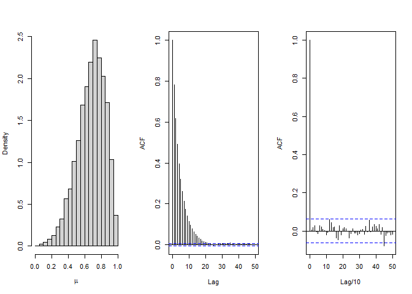
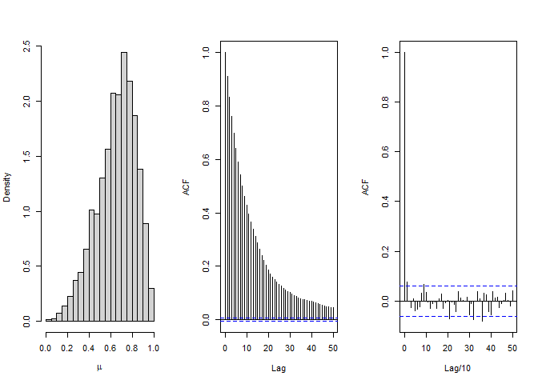

# importance sampling

$$\mathrm{E} \{ h(\theta\|y) \} = \frac{\int \[h(\theta)q(\theta\|y)/g(\theta)\]g(\theta)d\theta}{\int \[q(\theta\|y)/g(\theta)\]g(\theta)d\theta} \Longrightarrow \frac{S^{-1}\sum\_{s=1}^S h(\theta^s) w(\theta^s) }{S^{-1}\sum\_{s=1}^S w(\theta^s) }, w(\theta^s) = \frac{q(\theta^s\|y)}{g(\theta^s)}$$

effective sample size
$$S\_{\mbox{eff}} = \frac{1}{\sum\_{s=1}^S (\hat{w}(\theta^s))^2 }$$

sampling-importance resampling (SIR)

-   sample {*θ*<sup>1</sup>, …, *θ*<sup>*S*</sup>} from *g*(*θ*)

-   sample without replacement *k* \< *S* *θ* from
    {*θ*<sup>1</sup>, …, *θ*<sup>*S*</sup>} with probability
    proportional to $w(\theta^s) = \frac{q(\theta^s\|y)}{g(\theta^s)}$

target $0.7(5,3) + 0.3(6,10)

envelope U(0,1)

``` r
> nsamp <- 200
> x <- runif(nsamp, 0, 1)
> # weights
> w <- (0.7 * dbeta(x, 5, 3) + 0.3 * dbeta(x, 6, 10)) / dunif(x, 0, 1)
> # standardize
> wstd <- w / sum(w)
> 
> # population mean
> 0.7 * (5 / (5 + 3)) + 0.3 * (6 / (6 + 10))
```

    [1] 0.55

``` r
> # sample mean
> y <- numeric(nsamp)
> for (i in 1:nsamp) {
+   if (runif(1, 0, 1) <= 0.7) {
+     y[i] <- rbeta(1, 5, 3)
+   } else  {
+     y[i] <- rbeta(1, 6, 10)
+   }
+ }
> mean(y)
```

    [1] 0.5586604

``` r
> # importance sampling
> # estimand g(x) = x
> mean(x * w)
```

    [1] 0.5319114

``` r
> sum(x * wstd)
```

    [1] 0.5594732

# Metropolis algorithm

-   a symmetric proposal distribution.
    uniform(*θ*<sup>(*s*)</sup> − *δ*, *θ*<sup>(*s*)</sup> + *δ*),
    normal(*θ*<sup>(*s*)</sup>, *δ*<sup>2</sup>)

1.  sample *θ*<sup>\*</sup> ∼ *J*(*θ*\|*θ*<sup>(*s*)</sup>)

2.  compute acceptance ratio
    $$r=\frac{p(\theta^\*\|y)}{p(\theta^{(s)}\|y)}=\frac{p(y\|\theta^\*)p(\theta^\*)}{p(y\|\theta^{(s)})p(\theta^{(s)})}$$

3.  let
    $$\theta^{(s+1)}=\begin{cases} \theta^\* & \mbox{with probability }\min(r,1)\\
    \theta^{(s)}& \mbox{with probability }1-\min(r,1)\end{cases}$$

  

  

example
$$\begin{aligned}
y_1,\dots,y_n \|\theta &\overset{i.i.d.}{\sim} \mathrm{normal}(\theta,\sigma^2)\\
\theta &\sim \mathrm{normal}(\mu,\tau^2)\\
\theta\|\sigma^2,y_1,\dots,y_n &\sim  \mathrm{normal}(\mu_n,\tau_n^2)
\end{aligned}$$

$\mu_n=\frac{\mu_0/\tau_0^2 + {n}\bar{y}/{\sigma^2}}{{1}/{\tau_0^2} + {n}/{\sigma^2}}$
and $\tau_n^2 = \frac{1}{{1}/{\tau_0^2} + {n}/{\sigma^2}}$

normal proposal
*θ*<sup>\*</sup> ∼ normal(*θ*<sup>(*s*)</sup>,*δ*<sup>2</sup>)

log *r* = ∑\[log dnorm(*y*,*θ*<sup>\*</sup>,*σ*)−log dnorm(*y*,*θ*<sup>(*s*)</sup>,*σ*)\] + log dnorm(*θ*<sup>\*</sup>,*μ*,*τ*) − log dnorm(*θ*<sup>(*s*)</sup>,*μ*,*τ*)

``` r
> # Fig 10.3 Results from the Metropolis algorithm for the normal model
> # http://www2.stat.duke.edu/~pdh10/FCBS/Replication/chapter10.R
> 
> s2 <- 1 
> t2 <- 10 ; mu <- 5
> 
> set.seed(1)
> n <- 5
> # y <- round(rnorm(n,10,1),2)
> y <- c(9.37, 10.18, 9.16, 11.60, 10.33)
> 
> mu_n <- ( mean(y)*n/s2 + mu/t2 ) / ( n/s2 + 1/t2 ) 
> t2_n <- 1 / (n/s2+1/t2)
> 
> delta <-2 ; nsamp <- 10000 
> 
> # initialization 
> theta <- 0 ;  vtehta <- numeric(nsamp)
> 
> for(s in 1:nsamp) {
+ 
+   theta_star <- rnorm(1, theta, sqrt(delta))
+ 
+   log.r <- ( sum( dnorm(y, theta_star, sqrt(s2), log = TRUE) ) + 
+                dnorm(theta_star, mu, sqrt(t2), log = TRUE) )  -
+             ( sum( dnorm(y, theta, sqrt(s2), log = TRUE) ) +
+                 dnorm(theta, mu, sqrt(t2), log = TRUE) ) 
+ 
+   if (log(runif(1)) < log.r) { theta <- theta_star }
+ 
+   vtehta[s] <- theta
+ 
+ }
> 
> par(mfrow = c(2,2), mar = c(3,3,1,1), mgp = c(1.75,.75,0))
> 
> by10 <- seq(10, nsamp, by = 10)
> plot( by10, vtehta[by10], type = "l", xlab = "iteration", ylab = expression(theta) )
> 
> hist( vtehta[-(1:50)], prob = TRUE, main = "", xlab = expression(theta), ylab = "density" )
> th <- seq(min(vtehta), max(vtehta), length = 100)
> lines( th, dnorm(th, mu_n, sqrt(t2_n)) )
> 
> acf(vtehta, lag.max = 50)
> thin<-c(1,(1:1000)*(nsamp/1000))
> acf(vtehta[thin], lag.max = 50, xlab="Lag/10")
```


``` r
> library(coda)
> effectiveSize(vtehta)
```

        var1 
    1427.451 

show convergence

-   small step → high correlation

-   large step → high rejection

``` r
> par(mfrow=c(2,3))
> vacr <- vacf <- numeric(5)
> nsamp <- 10000
> 
> vdelta2 <- 2^c(-5,-1,1,5,7)
> 
> for( k in 1:5 ) {
+   
+   set.seed(1)
+   delta2 <- vdelta2[k]
+   vtheta <- numeric(nsamp)
+   theta <- 0
+   cnt_ac <- 0
+ 
+   for(s in 1:nsamp) {
+   
+     theta_star <- rnorm(1, theta, sqrt(delta2))
+     log.r <- sum( dnorm(y, theta_star, sqrt(s2), log = TRUE) -
+                   dnorm(y, theta, sqrt(s2), log = TRUE) ) + 
+               dnorm(theta_star, mu, sqrt(t2), log = TRUE) -
+                 dnorm(theta, mu, sqrt(t2), log = TRUE) 
+   
+     if ( log(runif(1)) < log.r )  { theta <- theta_star ; cnt_ac <- cnt_ac + 1 }
+     vtehta[s] <- theta
+   
+   }
+   
+   plot( vtehta[1:1000], type = "l", xlab = "iteration", ylab = expression(theta), 
+         ylim = range(vtehta), main = delta2 ) 
+   abline(h = mu_n, lty = 2)
+ 
+   vacr[k] <- cnt_ac/nsamp
+   vacf[k] <- acf(vtehta, plot=FALSE)$acf[2]
+ }
> 
> # acceptance ratio vs acf
> plot(vacr, vacf, xlab ="acceptance ratio", ylab = "acf") 
> lines(vacr, vacf)
> 
> for (k in 1:5) {
+   text(vacr[k], vacf[k], vdelta2[k])
+ }
```


#Metropolis-Hastings algorithm

1.  update *U*:

-   1.  sample from a proposal distribution (jumping distribution)
        *u* ∼ *J*<sub>*u*</sub>(*u*\|*u*<sup>(*s*)</sup>,*v*<sup>(*s*)</sup>)
-   1.  compute the acceptance ratio
        $$r = \frac{p_0(u^\*,v^{(s)})}{p_0(u^{(s)},v^{(s)})}\frac{J_u(u^{(s)}\|u^\*,v^{(s)})}{J_u(u^\*{(s)}\|u^{(s)},v^{(s)})}$$
-   1.  set
        $$u^{(s+1)} = \begin{cases}  u^\* & \mbox{ with probability } \min(1,r)\\
                                            u^{(s)} & \mbox{ with probability } 1-\min(1,r)\end{cases}$$

1.  update *V* :

-   1.  sample
        *v* ∼ *J*<sub>*v*</sub>(*v*\|*u*<sup>(*s*+1)</sup>,*v*<sup>(*s*)</sup>)

-   1.  compute the acceptance ratio
        $$r = \frac{p_0(u^{(s+1)},v^\*)}{p_0(u^{(s+1)},v^{(s)})}\frac{J_v(v^{(s)}\|u^{(s+1)},v^\*)}{J_v(v^\*\|u^{(s+1)},v^{(s)})}$$

-   1.  set
        $$v^{(s+1)} = \begin{cases}  v^\* & \mbox{ with probability } \min(1,r)\\
                                            v^{(s)} & \mbox{ with probability } 1-\min(1,r)\end{cases}$$

-   independent Metropolis-Hastings - independent proposal
    *J*<sub>*u*</sub>(*u*<sup>(*s*+1)</sup>\|*u*<sup>(*s*)</sup>,*v*<sup>(*s*)</sup>) = *J*<sub>*u*</sub>(*u*<sup>(*s*+1)</sup>)

-   random-walk Metropolis - Metropolis algorithm - symetric proposal
    distribution
    *J*<sub>*u*</sub>(*u*\|*u*′,*v*) = *J*<sub>*u*</sub>(*u*′\|*u*,*v*)

    -   efficient jumping rule:
        *J*(*θ*<sup>8</sup>\|*θ*<sup>*t* − 1</sup>) = dnorm(*θ*<sup>\*</sup>;*θ*<sup>*t* − 1</sup>,*c*<sup>2</sup>*Σ*),
        where *Σ* is the known posterior variance, the most efficient
        scale $c \approx 2.4/\sqrt{d}$
    -   multidimensional Metropolis algorithm is optimal efficient when
        its acceptance rate is approximately 23%
    -   adaptive algorithm: adaptive phase is biased. use the fixed
        phase

-   Gibbs sampler - full condition distribution proposal
    *J*<sub>*u*</sub>(*u*′\|*u*,*v*) = *p*<sub>0</sub>(*u*′\|*v*)

    -   reparameterization, auxiliary variables (data augmentation),
        parameter expansion
    -   BUGS (Bayesian inference Using Gibbs Sampling)

1.  discard the first half as a aconservative choice

2.  thin the sequence by keeping evety *k*th simulation draw due to
    denpendence such that the total number of iterations saved is n o
    more than 1000

3.  split each saved sequence into two parts (*m* chains of length *n*)
    to assess mixing
    $$\begin{aligned}
    \mbox{between-sequence variation }B &= \frac{n}{m-1} \sum\_{j=1}^m(\bar{\psi}\_{.j} - \bar{\psi}\_{..})^2, \mbox{ where }\bar{\psi}\_{.j} = \frac{1}{n}\sum\_{i=1}^m\bar{\psi}\_{ij}, \bar{\psi}\_{..} = \frac{1}{m}\sum\_{j=1}^m\bar{\psi}\_{.j}\\
    \mbox{within-sequence variation }W &= \frac{1}{m} \sum\_{j=1}^m s_j^2, \mbox{ where }s\_{j}^2 = \frac{1}{n-1}\sum\_{i=1}^m(\bar{\psi}\_{ij}- \bar{\psi}\_{.j})^2 \\
    \widehat{\mbox{Var}}^+ &= \frac{1}{n}B + \frac{n-1}{n}W\\
    \mbox{potential scale reduction } \hat{R} &= \sqrt{\frac{\widehat{\mbox{Var}}^+}{W}}\\
    \mbox{effective size }\hat{n}\_{\mbox{eff}} &= \frac{mn}{1+ 2\sum\_{t=1}^T\hat{\rho}\_t}, \mbox{ where }T\mbox{ is the first odd positive integer for which }\hat{\rho}\_{T+1}+\hat{\rho}\_{T+2} \mbox{ is negative }\\
    \hat{\rho}\_t &= 1- \frac{V_t}{2\widehat{\mbox{Var}}^+}\quad \mbox{from   E}\[({\psi}\_{i,j}- {\psi}\_{i-t,j})^2\]=2(1-\rho_t)\mbox{Var}(\psi)\\
    \mbox{varigram } V_t &= \frac{1}{m(n-t)}\sum\_{i=t+1}^n\sum\_{j=1}^m({\psi}\_{i,j}- {\psi}\_{i-t,j})^2  \\
    \Bigg(\lim\limits\_{n\to\infty} mn \mbox{Var}(\bar{\psi}\_{..}) &= \left\[1+ 2\sum\_{t=1}^{\infty}{\rho}\_t\right\]\mbox{Var}(\psi\|y)\Longrightarrow n\_{\mbox{eff}} = \frac{\mbox{Var}(\psi\|y)}{\mbox{Var}(\bar{\psi}\_{..})} = \frac{mn}{1+ 2\sum\_{t=1}^{\infty}{\rho}\_t}\Bigg)
    \end{aligned}$$
    transform sequence distributed far from normal before computing *R̂*
    and *n̂*<sub>eff</sub> for better perfromance of mean and
    variance-based convergernce diagnostics

4.  stop until *R̂* near 1 (1.1 as a threshold) and
    *n̂*<sub>eff</sub> ≥ 5*m*. Then collect the *n**m* simulations

#Hamiltonian Monte Carlo

1.  update momentum *ϕ* ∼ *N*(0,*M*)

2.  *L* leapfrog step

    -   half-step update momentum
        $\phi \leftarrow \phi + \frac{1}{2}\epsilon\frac{d \log p(\theta\|y)}{d\theta}$
    -   update position *θ* ← *θ* + *ϵ**M*<sup>−1</sup>*ϕ*
    -   half-step update momentum
        $\phi \leftarrow \phi + \frac{1}{2}\epsilon\frac{d \log p(\theta\|y)}{d\theta}$

3.  accept-reject step
    $r = \frac{p(\theta^\*\|y)p(\theta^\*)}{p(\theta^{t-1}\|y)p(\phi^{t-1})}$
    $$\theta^t = \begin{cases}\theta^\* &\mbox{with probability }\min(r,1)\\
    \theta^{t-1}&\mbox{otherwise}\end{cases}$$

*ϵ**L* = 1 (*ϵ* = 01, *L* = 10)

HMC is optimal efficient when its acceptance rate is approximately 65%

Stan (Sampling through adaptive neighborhoods)

  

  

$$\begin{aligned}
X &\sim \mathrm{norm}(\mu,\sigma^2)\\
\mu &\sim \mathrm{beta}(2,2)\\
\sigma^2 &\sim \mathrm{lognormal}(1,10)
\end{aligned}$$

``` r
> x <- c(2.366,2.495,1.084,0.759,0.878,1.276,1.460,0.180,-1.01,1.487,-0.119,0.258)
```

## independent MH with prior proposal *p*(*θ*<sup>\*</sup>) = *J*<sub>*θ*</sub>(*θ*<sup>\*</sup>)

$$r=\frac{p(y\|\theta^\*)}{p(y\|\theta^{(s)})}$$

``` r
> nsamp <- 100000
> nburn <- 50000
> 
> vmu <- numeric(nsamp)
> vsig2 <- numeric(nsamp)
> 
> set.seed(1)
> 
> 
> mu <- rbeta(1, 2, 2)
> sig2 <- rlnorm(1, sqrt(10))
> 
> naccept <- 0
> 
> loglikelihood <- function (mu, sig2, x) {
+   return(sum(dnorm(x, mu, sqrt(sig2), log=T)) )
+ }
> 
> 
> for (s in 1:nsamp) {
+   mu_new <- rbeta(1, 2, 2)
+   sig2_new <- rlnorm(1, sqrt(10))
+   
+   logr <- loglikelihood(mu_new, sig2_new, x) - loglikelihood(mu, sig2, x) 
+   
+   u <- runif(1)
+   if (logr >= log(u)) {
+     mu <- mu_new
+     sig2 <- sig2_new
+     naccept <- naccept + 1
+   }
+   
+   vmu[s] <- mu
+   vsig2[s] <- sig2
+ }
> 
> effectiveSize(vmu)
```

       var1 
    878.203 

``` r
> effectiveSize(vsig2)
```

        var1 
    1223.509 

``` r
> naccept/nsamp
```

    [1] 0.02551

``` r
> median(vmu)
```

    [1] 0.6364326

``` r
> median(vmu[(nburn+1):nsamp])
```

    [1] 0.6246554

``` r
> par(mfrow = c(1,3))
> hist(vmu[(nburn+1):nsamp], xlab = expression(mu),  main = "", freq = F)
> acf(vmu, lag.max = 50,  main = "")
> thin<-c(1,(1:1000)*((nsamp-nburn)/1000))
> acf(vmu[(nburn+1):nsamp][thin], lag.max = 50, xlab="Lag/10",  main = "")
```


## independent MH with general proposal

$$r=\frac{p(y\|\theta^\*)p(\theta^\*)}{p(y\|\theta^{(s)})p(\theta^{(s)})} \frac{J\_{\theta}(\theta^{(s)})}{J\_{\theta}(\theta^\*)}$$

``` r
> nsamp <- 100000
> nburn <- 50000
> 
> vmu <- numeric(nsamp)
> vsig2 <- numeric(nsamp)
> 
> set.seed(1)
> 
> mu <- rbeta(1, 2, 2)
> sig2 <- rlnorm(1, sqrt(10))
> 
> naccept <- 0
> 
> logpost <- function (mu, sig2, x) {
+   return( sum(dnorm(x, mu, sqrt(sig2), log=T)) + dbeta(mu, 2, 2, log=T) + 
+             dlnorm(sig2, 1, sqrt(10), log=T) )
+ }
> 
> 
> for (s in 1:nsamp) {
+   mu_new <- runif(1)
+   sig2_new <- rchisq(1, 1)
+   
+   logr <- logpost(mu_new, sig2_new, x) - logpost(mu, sig2, x) + 
+     dchisq(sig2,1, log=T) - dchisq(sig2_new,1, log=T) 
+   
+   u <- runif(1)
+   if (logr >= log(u)) {
+     mu <- mu_new
+     sig2 <- sig2_new
+     naccept <- naccept + 1
+   }
+   
+   vmu[s] <- mu
+   vsig2[s] <- sig2
+ }
> 
> effectiveSize(vmu)
```

        var1 
    12713.03 

``` r
> effectiveSize(vsig2)
```

        var1 
    15140.68 

``` r
> naccept/nsamp
```

    [1] 0.20383

``` r
> median(vmu)
```

    [1] 0.67965

``` r
> median(vmu[(nburn+1):nsamp])
```

    [1] 0.6813197

``` r
> par(mfrow = c(1,3))
> hist(vmu[(nburn+1):nsamp], xlab = expression(mu),  main = "", freq = F)
> acf(vmu, lag.max = 50,  main = "")
> thin<-c(1,(1:1000)*((nsamp-nburn)/1000))
> acf(vmu[(nburn+1):nsamp][thin], lag.max = 50, xlab="Lag/10",  main = "")
```


## if omit ratio of proposal

``` r
> nsamp <- 100000
> nburn <- 50000
> 
> vmu <- numeric(nsamp)
> vsig2 <- numeric(nsamp)
> 
> set.seed(1)
> 
> mu <- rbeta(1, 2, 2)
> sig2 <- rlnorm(1, sqrt(10))
> 
> naccept <- 0
> 
> logpost <- function (mu, sig2, x) {
+   return( sum(dnorm(x, mu, sqrt(sig2), log=T)) + dbeta(mu, 2, 2, log=T) + 
+             dlnorm(sig2, 1, sqrt(10), log=T) )
+ }
> 
> 
> for (s in 1:nsamp) {
+   mu_new <- runif(1)
+   sig2_new <- rchisq(1, 1)
+   
+   logr <- logpost(mu_new, sig2_new, x) - logpost(mu, sig2, x) 
+   
+   u <- runif(1)
+   if (logr >= log(u)) {
+     mu <- mu_new
+     sig2 <- sig2_new
+     naccept <- naccept + 1
+   }
+   
+   vmu[s] <- mu
+   vsig2[s] <- sig2
+ }
> 
> effectiveSize(vmu)
```

        var1 
    11116.81 

``` r
> effectiveSize(vsig2)
```

        var1 
    12145.59 

``` r
> naccept/nsamp
```

    [1] 0.1758

``` r
> median(vmu)
```

    [1] 0.6969797

``` r
> median(vmu[(nburn+1):nsamp])
```

    [1] 0.6956991

``` r
> par(mfrow = c(1,3))
> hist(vmu[(nburn+1):nsamp], xlab = expression(mu),  main = "", freq = F)
> acf(vmu, lag.max = 50,  main = "")
> thin<-c(1,(1:1000)*((nsamp-nburn)/1000))
> acf(vmu[(nburn+1):nsamp][thin], lag.max = 50, xlab="Lag/10",  main = "")
```



# random walk MH *J*<sub>*θ*</sub>(*θ*<sup>\*</sup>\|*θ*<sup>(*s*)</sup>) = *J*<sub>*θ*</sub>(*θ*<sup>(*s*)</sup>\|*θ*<sup>\*</sup>)

$$r=\frac{p(\theta^\*\|y)}{p(\theta^{(s)}\|y)}=\frac{p(y\|\theta^\*)p(\theta^\*)}{p(y\|\theta^{(s)})p(\theta^{(s)})}$$

``` r
> nsamp <- 100000
> nburn <- 50000
> 
> vmu <- numeric(nsamp)
> vlogsig2 <- numeric(nsamp)
> 
> set.seed(1)
> 
> mu <- rbeta(1, 2, 2)
> logsig2 <- rnorm(1, sqrt(10))
> 
> delta_mu <- 0.5
> delta_logsig2 <- 5
> 
> naccept <- 0
> 
> logpost <- function (mu, logsig2, x) {
+   return( sum(dnorm(x, mu, sqrt(exp(logsig2)), log=T)) + dbeta(mu, 2, 2, log=T) +
+             dnorm(logsig2, 1, sqrt(10), log=T) )
+ }
> 
> 
> for (s in 1:nsamp) {
+   repeat {
+         mu_new <- mu + runif(1,-delta_mu,delta_mu)
+         if (mu_new >= 0 & mu_new <= 1)
+           break
+   }
+   
+   logsig2_new <- rnorm(1,logsig2, delta_logsig2)
+ 
+   logr <- logpost(mu_new, logsig2_new, x) - logpost(mu, logsig2, x) +
+     log(min(1,mu+delta_mu)-max(0,mu-delta_mu)) -
+     log(min(1,mu_new+delta_mu)-max(0,mu_new-delta_mu))
+ 
+   u <- runif(1)
+   if (logr >= log(u)) {
+     mu <- mu_new
+     logsig2 <- logsig2_new
+     naccept <- naccept + 1
+   }
+ 
+   vmu[s] <- mu
+   vlogsig2[s] <- logsig2
+ }
> 
> effectiveSize(vmu)
```

        var1 
    3656.838 

``` r
> effectiveSize(exp(vlogsig2))
```

       var1 
    5845.11 

``` r
> naccept/nsamp
```

    [1] 0.08299

``` r
> median(vmu)
```

    [1] 0.671955

``` r
> median(vmu[(nburn+1):nsamp])
```

    [1] 0.6713271

``` r
> par(mfrow = c(1,3))
> hist(vmu[(nburn+1):nsamp], xlab = expression(mu),  main = "", freq = F)
> acf(vmu, lag.max = 50,  main = "")
> thin<-c(1,(1:1000)*((nsamp-nburn)/1000))
> acf(vmu[(nburn+1):nsamp][thin], lag.max = 50, xlab="Lag/10",  main = "")
```


``` r
> nsamp <- 100000
> nburn <- 50000
> 
> vmu <- numeric(nsamp)
> vsig2 <- numeric(nsamp)
> 
> set.seed(1)
> 
> mu <- rbeta(1, 2, 2)
> sig2 <- rlnorm(1, sqrt(10))
> 
> delta_mu <- 0.5
> delta_sig2 <- 5
> 
> naccept <- 0
> 
> logpost <- function (mu, sig2, x) {
+   return( sum(dnorm(x, mu, sqrt(sig2), log=T)) + dbeta(mu, 2, 2, log=T) +
+             dlnorm(sig2, 1, sqrt(10), log=T) )
+ }
> 
> 
> for (s in 1:nsamp) {
+   repeat {
+         mu_new <- rnorm(1,mu,delta_mu)
+         if (mu_new >= 0 & mu_new <= 1)
+           break
+   }
+   
+   repeat {
+         sig2_new <- rnorm(1,sig2,delta_sig2)
+         if (sig2_new > 0)
+           break
+   }
+   
+ 
+   logr <- logpost(mu_new, sig2_new, x) - logpost(mu, sig2, x) +
+       log(pnorm(1,mu,delta_mu)-pnorm(0,mu,delta_mu)) -
+       log(pnorm(1,mu_new,delta_mu)-pnorm(0,mu_new,delta_mu)) +
+       log(1-pnorm(0,sig2,delta_sig2)) -
+       log(1-pnorm(0,sig2_new,delta_sig2)) 
+ 
+   u <- runif(1)
+   if (logr >= log(u)) {
+     mu <- mu_new
+     sig2 <- sig2_new
+     naccept <- naccept + 1
+   }
+ 
+   vmu[s] <- mu
+   vsig2[s] <- sig2
+ }
> 
> effectiveSize(vmu)
```

       var1 
    6646.77 

``` r
> effectiveSize(vsig2)
```

        var1 
    7085.968 

``` r
> naccept/nsamp
```

    [1] 0.13586

``` r
> median(vmu)
```

    [1] 0.6801212

``` r
> median(vmu[(nburn+1):nsamp])
```

    [1] 0.6816259

``` r
> par(mfrow = c(1,3))
> hist(vmu[(nburn+1):nsamp], xlab = expression(mu),  main = "", freq = F)
> acf(vmu, lag.max = 50,  main = "")
> thin<-c(1,(1:1000)*((nsamp-nburn)/1000))
> acf(vmu[(nburn+1):nsamp][thin], lag.max = 50, xlab="Lag/10",  main = "")
```


# independent MH *μ* and random walk MH log (*σ*<sup>2</sup>)

``` r
> nsamp <- 100000
> nburn <- 50000
> 
> vmu <- numeric(nsamp)
> vlogsig2 <- numeric(nsamp)
> 
> set.seed(1)
> 
> mu <- rbeta(1, 2, 2)
> logsig2 <- rnorm(1, sqrt(10))
> 
> 
> delta_logsig2 <- 5
> 
> naccept <- 0
> 
> logpost <- function (mu, logsig2, x) {
+   return( sum(dnorm(x, mu, sqrt(exp(logsig2)), log=T)) + dbeta(mu, 2, 2, log=T) + 
+             dnorm(logsig2, 1, sqrt(10), log=T) )
+ }
> 
> 
> for (s in 1:nsamp) {
+   mu_new <- runif(1)
+   logsig2_new <- rnorm(1,logsig2, delta_logsig2)
+   
+   logr <- logpost(mu_new, logsig2_new, x) - logpost(mu, logsig2, x) 
+   
+   u <- runif(1)
+   if (logr >= log(u)) {
+     mu <- mu_new
+     logsig2 <- logsig2_new
+     naccept <- naccept + 1
+   }
+   
+   vmu[s] <- mu
+   vlogsig2[s] <- logsig2
+ }
> 
> effectiveSize(vmu)
```

       var1 
    3937.31 

``` r
> effectiveSize(exp(vlogsig2))
```

        var1 
    4806.368 

``` r
> naccept/nsamp
```

    [1] 0.06895

``` r
> median(vmu)
```

    [1] 0.6776655

``` r
> median(vmu[(nburn+1):nsamp])
```

    [1] 0.6787322

``` r
> par(mfrow = c(1,3))
> hist(vmu[(nburn+1):nsamp], xlab = expression(mu),  main = "", freq = F)
> acf(vmu, lag.max = 50,  main = "")
> thin<-c(1,(1:1000)*((nsamp-nburn)/1000))
> acf(vmu[(nburn+1):nsamp][thin], lag.max = 50, xlab="Lag/10",  main = "")
```


