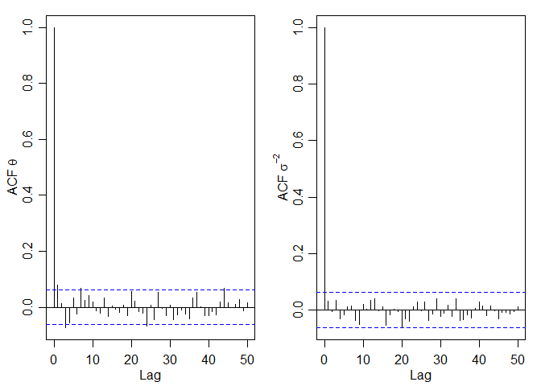

given *σ*<sup>2</sup>

<!-- sampling model $p(y|\theta,\sigma^2) = \mathrm{dnorm}(y,\theta,\sigma) =\frac{1}{\sqrt{2\pi\sigma^2}} e^{-\frac{1}{2}\left(\frac{y-\theta}{\sigma}\right)^2}, \ y \in \mathbb{R}$ -->
<!-- conditional prior $p(\theta|\sigma^2) = \mathrm{dnorm}(y,\mu_0,\tau_0)$ -->

sampling model

$$Y_1,\dots,Y_n\|\theta,\sigma^2 \overset{\mathrm i.i.d.}{\sim}\mathrm{normal}(\theta,\sigma^2)$$

conditional prior
*θ*\|*σ*<sup>2</sup> ∼ normal(*μ*<sub>0</sub>, *τ*<sub>0</sub><sup>2</sup>)

posterior
*θ*\|*σ*<sup>2</sup>, *y*<sub>1</sub>, …, *y*<sub>*n*</sub> ∼ normal(*μ*<sub>*n*</sub>, *τ*<sub>*n*</sub><sup>2</sup>)

<!-- posterior $p(\theta|\sigma^2,y_1,\dots,y_n) = \mathrm{dnorm}(\theta,\mu_n,\tau_n)$, where $\mu_n=\frac{\frac{1}{\tau_0^2}\mu_0 + \frac{n}{\sigma^2}\bar{y}}{\frac{1}{\tau_0^2} + \frac{n}{\sigma^2}}$ and -->
<!-- $\tau_n^2 = \frac{1}{\frac{1}{\tau_0^2} + \frac{n}{\sigma^2}}$ -->

$\mu_n=\frac{\mu_0/\tau_0^2 + {n}\bar{y}/{\sigma^2}}{{1}/{\tau_0^2} + {n}/{\sigma^2}}$
and $\tau_n^2 = \frac{1}{{1}/{\tau_0^2} + {n}/{\sigma^2}}$

set $\tau_0^2 = \frac{\sigma^2}{\kappa_0}$,
$\mu_n = \frac{\kappa_0}{\kappa_0 + n} \mu_0 + \frac{n}{\kappa_0 + n} \bar{y}$
and
$\tau_n^2 = \frac{\sigma^2}{\kappa_0 + n} = \frac{\sigma^2}{\kappa_n}$,
where *κ*<sub>*n*</sub> = *κ*<sub>0</sub> + *n*

  

  

joint prior
*p*(*θ*,*σ*<sup>2</sup>) = *p*(*θ*\|*σ*<sup>2</sup>)*p*(*σ*<sup>2</sup>)
<!-- prior $p(\theta,\sigma^2) = p(\theta|\sigma^2)p(\sigma^2) = \mathrm{dnorm}(\theta,\mu_0,\tau_0=\frac{\sigma}{\sqrt{\kappa_0}})p(\sigma^2)$, $p(\frac{1}{\sigma^2}) = \mathrm{dgamma}(\frac{1}{\sigma^2},\frac{\nu_0^2}{2},\frac{\nu_0^2}{2}\sigma_0^2)$ -->

<!-- posterior $p(\theta|\sigma^2,y_1,\dots,y_n) = \mathrm{dnorm}(\theta,\mu_n,\tau_n=\frac{\sigma}{\sqrt{\kappa_n}})$, -->
<!-- $p(\frac{1}{\sigma^2}|y_1,\dots,y_n) = \mathrm{dgamma}(\frac{1}{\sigma^2},\frac{\nu_n^2}{2},\frac{\nu_n^2}{2}\sigma_n^2)$,  -->

$$\begin{aligned}
1/\sigma^2 &\sim \mathrm{gamma}(\frac{\nu_0^2}{2},\frac{\nu_0^2}{2}\sigma_0^2)\\
\theta\|\sigma^2 &\sim  \mathrm{normal}(\mu_0,\frac{\sigma^2}{{\kappa_0}})\\
Y_1,\dots,Y_n\|\theta,\sigma^2 &\overset{\mathrm i.i.d.}{\sim}\mathrm{normal}(\theta,\sigma^2)
\end{aligned}$$

posterior

$$\begin{aligned}
1/\sigma^2\|y_1,\dots,y_n &\sim \mathrm{gamma}(\frac{\nu_n^2}{2},\frac{\nu_n^2}{2}\sigma_n^2)\\
\theta\|\sigma^2,y_1,\dots,y_n &\sim  \mathrm{normal}(\mu_n,\frac{\sigma^2}{{\kappa_n}})
\end{aligned}$$

*ν*<sub>*n*</sub> = *ν*<sub>0</sub> + *n* and
$\sigma_n^2 = \frac{1}{\nu_n}\[\nu_0^2\sigma_0^2 + (n-1)s^2 + \frac{\kappa_0n}{\kappa_n}(\bar{y}-\mu_0)2\]$,
$s^2 = \frac{1}{n-1}\sum\limits\_{l=1}^n(y_l - \bar{y})^2$

``` r
> # Fig 5.4 Joint posterior distributions of (theta, sigma^-2) and  (theta, sigma^2)
> # http://www2.stat.duke.edu/~pdh10/FCBS/Replication/chapter5.R
> # prior
> # 1/sigma^2 ~ dgamma(nu_0/2, nu_0 sigma^2_0/2)
> s2_0 <- 0.01 ; nu_0 <- 1
> # theta|sigma^2 ~ dnorm(mu_0, sigma/sqrt(k_0))
> mu_0 <- 1.9 ; k_0 <- 1
> 
> ## data
> y <- c(1.64, 1.70, 1.72, 1.74, 1.82, 1.82, 1.82, 1.90, 2.08)
> n <- length(y) ; ybar<-mean(y) ; s2 <- var(y)
> 
> ## posterior inference
> k_n <- k_0 + n ; nu_n <- nu_0 + n
> mu_n <- ( k_0 * mu_0 + n * ybar ) / k_n  
> s2_n <- ( nu_0 * s2_0 + (n-1) * s2 + k_0 * n * (ybar - mu_0)^2 / k_n ) / nu_n
> mu_n
```

    [1] 1.814

``` r
> s2_n
```

    [1] 0.015324

``` r
> # density of inverse gamma beta^alpha / Gamma(alpha) * x^-(alpha+1) exp(-beta/x)
> dinvgamma<-function(x,a,b) {
+   ld <- a * log(b) - lgamma(a) - (a+1) * log(x) - b / x 
+   exp(ld)
+ }
> 
> # grid size
> gs <- 100
> theta_g <- seq(1.6, 2.0, length = gs)
> is2_g <- seq(15, 160 , length = gs)
> s2_g <- seq(0.001, 0.045, length = gs)
> 
> # log density theta inverse sigma square / sigma square
> ld.th.is2 <- ld.th.s2 <- matrix(0, gs, gs)
> for(i in 1:gs) { 
+   for(j in 1:gs) {
+     ld.th.is2[i,j]<- dnorm( theta_g[i], mu_n, 1/sqrt(is2_g[j]*k_n), log = TRUE ) +
+                    dgamma( is2_g[j], shape = nu_n/2, rate = nu_n*s2_n/2, log = TRUE )
+     ld.th.s2[i,j]<- dnorm( theta_g[i], mu_n, sqrt(s2_g[j]/k_n), log = TRUE ) +
+                     log( dinvgamma(s2_g[j], nu_n/2, nu_n * s2_n/2 ) )
+   }
+ } 
> 
> par(mfrow = c(1,2), mar = c(3,3,1,1), mgp = c(1.75,0.75,0))
> grays <- gray((10:0)/10)
> image( theta_g, is2_g, exp(ld.th.is2), col = grays, xlab = expression(theta),
+        ylab = expression(sigma^{-2}) ) 
> image( theta_g, s2_g, exp(ld.th.s2), col = grays, xlab = expression(theta),
+        ylab = expression(sigma^2) )
```


semiconjugate prior
*p*(*θ*,*σ*<sup>2</sup>) = *p*(*θ*)*p*(*σ*<sup>2</sup>)

$$\begin{aligned}
\theta\|\sigma^2 &\sim  \mathrm{normal}(\mu_0,\tau_0^2)\\
1/\sigma^2 &\sim \mathrm{gamma}(\frac{\nu_0^2}{2},\frac{\nu_0^2}{2}\sigma_0^2)\\
Y_1,\dots,Y_n\|\theta,\sigma^2 &\overset{\mathrm i.i.d.}{\sim}\mathrm{normal}(\theta,\sigma^2)
\end{aligned}$$

posterior

$$\begin{aligned}
\theta\|y_1,\dots,y_n &\sim  \mathrm{normal}(\mu_n,\tau_n^2)\\
1/\sigma^2\|y_1,\dots,y_n &\sim \mbox{some distribution not standard}\\
1/\sigma^2\|\theta,y_1,\dots,y_n &\sim \mathrm{gamma}(\frac{\nu_n^2}{2},\frac{\nu_n^2}{2}\sigma_n^2(\theta))
\end{aligned}$$

$\mu_n=\frac{\mu_0{\tau_0^2} + {n}\bar{y}/{\sigma^2}}{{1}/{\tau_0^2} + {n}/{\sigma^2}}$
and $\tau_n^2 = \frac{1}{{1}/{\tau_0^2} + {n}/{\sigma^2}}$

*ν*<sub>*n*</sub> = *ν*<sub>0</sub> + *n* and
$\sigma_n^2(\theta) = \frac{1}{\nu_n}\[\nu_0^2\sigma_0^2 + ns_n^2(\theta)\]$,
where
$s_n^2(\theta) = \frac{1}{n}\sum\limits\_{l=1}^n(y_l - \theta)^2=\frac{1}{n}\[(n-1)s^2+n(\bar{y}-\theta)^2\]$

``` r
> # Fig 6.1 Joint and marginal posterior distributions based on a discrete approximation (theta, sigma^-2)
> # http://www2.stat.duke.edu/~pdh10/FCBS/Replication/chapter6.R
> # prior
> # 1/sigma^2 ~ dgamma(nu_0/2, nu_0 sigma^2_0/2)
> s2_0 <- 0.01 ; nu_0 <- 1
> # theta ~ dnorm(mu_0, tau_0)
> mu_0 <- 1.9  ; t2_0 <- 0.95^2
> 
> # data
> y <- c(1.64, 1.70, 1.72, 1.74, 1.82, 1.82, 1.82, 1.90, 2.08)
> n <- length(y) ; ybar <- mean(y) ; s2 <- var(y)
> 
> 
> # grid size
> gs <- 100 
> theta_g <- seq(1.505, 2.00, length = gs) 
> is2_g <- seq(1.75, 175, length = gs) 
> 
> posterior_g <- matrix(0, nrow = gs, ncol = gs)
> 
> for(i in 1:gs) {
+   for(j in 1:gs) { 
+     posterior_g[i,j]<- dnorm( theta_g[i], mu_0, sqrt(t2_0) ) *
+                      dgamma( is2_g[j], nu_0/2, s2_0*nu_0/2 ) *
+                      prod( dnorm( y, theta_g[i], 1/sqrt(is2_g[j]) ) )
+   }
+ }
> 
> posterior_g <- posterior_g/sum(posterior_g)
> 
> par(mfrow = c(1,3), mar = c(3,3,1,1), mgp = c(1.70,0.70,0))
> image( theta_g, is2_g, posterior_g, col = grays, xlab = expression(theta), 
+        ylab=expression(sigma^{-2}) )
> 
> theta_p<- apply(posterior_g, 1, sum)
> plot( theta_g, theta_p, type = "l", xlab = expression(theta),
+      ylab = expression( paste( italic("p("), theta, "|", 
+                            italic(y[1]), "...", italic(y[n]), ")", sep="" ) ) )
> 
> is2_p <- apply(posterior_g, 2, sum)
> plot( is2_g, is2_p, type = "l", xlab = expression(sigma^{-2}),
+      ylab = expression( paste( italic("p("), sigma^{-2}, "|",
+                            italic(y[1]), "...", italic(y[n]), ")", sep="" ) ) ) 
```


noninformative prior
$$\begin{aligned}
p(\mu,\sigma^2) &\propto (\sigma^2)^{-1}\\
Y_1,\dots,Y_n\|\theta,\sigma^2 &\overset{\mathrm i.i.d.}{\sim}\mathrm{normal}(\theta,\sigma^2)\\
\mu\|\sigma^2,y_1,\dots,y_n &\sim \mathrm{norm}(\bar{y}, {\sigma^2}/{n})\\
1/\sigma^2\|y_1,\dots,y_n &\sim \mathrm{Gamma}((n-1)/{2}, {(n-1)s^2}/{2})\\
\mu\|y_1,\dots,y_n &\sim t_n(\bar{y},s^2/n)
\end{aligned}$$

Gibbs sampler

full conditional distribution
*p*(*θ*\|*σ*<sup>2</sup>,*y*<sub>1</sub>,…,*y*<sub>*n*</sub>) and
*p*(*σ*<sup>2</sup>\|*θ*,*y*<sub>1</sub>,…,*y*<sub>*n*</sub>)

$$\begin{aligned}
\theta\|\sigma^2,y_1,\dots,y_n \overset{\theta\perp\sigma}{=}\theta\|y_1,\dots,y_n &\sim  \mathrm{normal}(\mu_n,\tau_n^2) \\
1/\sigma^2\|\theta,y_1,\dots,y_n &\sim \mathrm{gamma}(\frac{\nu_n^2}{2},\frac{\nu_n^2}{2}\sigma_n^2(\theta))
\end{aligned}$$

``` r
> # http://www2.stat.duke.edu/~pdh10/FCBS/Replication/chapter6.R
> ## initial values
> set.seed(123)
> nsamp <- 1000
> mphi <- matrix(nrow = nsamp, ncol = 2)
> mphi[1,] <- phi <- c(ybar, 1/s2)
> 
> ## Gibbs sampling algorithm
> for(s in 2:nsamp) {
+   
+   # generate a new theta value from its full conditional
+   # mu_n = [mu_0/\tau_0^2 + n*ybar/sigma^2]/[1/tau_0^2 + n/sigma^2]
+   mu_n <-  ( mu_0/t2_0 + n*ybar*phi[2] ) / ( 1/t2_0 + n*phi[2] )
+   # tau_n^2 = 1/[1/tau_0^2 + n/sigma^2]
+   t2_n <- 1 / ( 1/t2_0 + n*phi[2] )
+   phi[1] <- rnorm( 1, mu_n, sqrt(t2_n) )
+   
+   # generate a new sigma^2 value from its full conditional
+   nu_n <- nu_0 + n
+   # sigma_n^2(\theta) = 1 / nu_n * [nu_0^2*sigma_0^2 + (n-1)*s^2 + n(ybar-theta)^2]
+   s2_n <- ( nu_0*s2_0 + (n-1)*s2 + n*(ybar-phi[1])^2 ) /nu_n
+   phi[2] <- rgamma( 1, nu_n/2, nu_n*s2_n/2 )
+   
+   mphi[s,]<-phi       
+ }
> 
> # Fig 6.2 The first 5, 15 and 100 iterations of a Gibbs sampler
> par(mfrow = c(1,3), mar = c(2.75,2.75,0.5,0.5), mgp = c(1.70,0.70,0))
> m1 <- 5
> plot( mphi[1:m1,], type = "l", xlim = range(mphi[1:100,1]), ylim = range(mphi[1:100,2]),
+      lty = 1, col = "gray", xlab = expression(theta), ylab = expression(sigma^{-2}) )
> text( mphi[1:m1,1], mphi[1:m1,2], c(1:m1) )
> 
> m1 <- 15
> plot( mphi[1:m1,], type = "l", xlim = range(mphi[1:100,1]), ylim = range(mphi[1:100,2]),
+      lty = 1, col = "gray", xlab = expression(theta), ylab = expression(sigma^{-2}) )
> text( mphi[1:m1,1], mphi[1:m1,2], c(1:m1) )
> 
> m1 <- 100
> plot( mphi[1:m1,], type = "l", xlim = range(mphi[1:100,1]), ylim = range(mphi[1:100,2]),
+      lty = 1, col = "gray", xlab = expression(theta), ylab = expression(sigma^{-2}))
> text( mphi[1:m1,1], mphi[1:m1,2], c(1:m1) )
```


``` r
> # Fig 6.2 distribution of Gibbs sample
> par(mfrow = c(1,3), mar = c(2.75,2.75,0.5,0.5), mgp = c(1.70,0.70,0))
> 
> image( theta_g, is2_g, posterior_g, col = grays,
+       xlab = expression(theta), ylab = expression(sigma^{-2}),
+       xlim = range(mphi[,1]), ylim = range(mphi[,2]) )
> points( mphi[,1], mphi[,2], pch = ".", cex = 1.25 )
> 
> plot( density(mphi[,1], adj = 2),  xlab = expression(theta), main = "", xlim = c(1.55,2.05),
+      ylab = expression( paste( italic("p("), theta, "|", italic(y[1]),
+                              "...", italic(y[n]), ")", sep = "" ) ) )
> abline( v = quantile(mphi[,1], prob = c(0.025,0.975)), lwd = 2, col = "gray" )
> 
> ## t-test based confidence interval
> ybar + qt( c(0.025,0.975), n-1 ) *sqrt(s2/n)
```

    [1] 1.704583 1.904306

``` r
> abline( v =  ybar + qt(c(0.025,0.975), n-1) * sqrt(s2/n), col = "black", lwd = 1 )
> 
> plot( density( mphi[,2], adj = 2 ), xlab = expression(sigma^{-2}), main = "",
+      ylab = expression( paste( italic("p("), sigma^{-2}, "|", italic(y[1]), 
+                               "...", italic(y[n]), ")",sep = "" ) ) ) 
```


MCMC variance

$$\begin{aligned}
\mbox{Var}\_{\mbox{MCMC}}(\bar{\phi}) &= \mbox{Var}\_{\mbox{MC}}(\bar{\phi}) + \frac{1}{S^2}\mbox{E}\\(\phi^{(s)}-\phi_0)(\phi^{(t)}-\phi_0)\\ = \frac{\mbox{Var}({\phi})}{S\_{\mbox{eff}}}\\
\mbox{Var}\_{\mbox{MC}}(\bar{\phi}) &= \frac{\mbox{Var}({\phi})}{S}\\
\mbox{Var}({\phi}) &= \int \phi^2p(\phi)d\phi - \phi_0^2\\
\mbox{E}\\\phi\\ &= \int \phi p(\phi)d\phi = \phi_0\\
\bar{\phi} &= \frac{1}{S}\sum \phi^{(s)}
\end{aligned}$$

``` r
> # effective sample size S_eff
> library(coda)
> effectiveSize( mphi[,1] )
```

        var1 
    912.9684 

``` r
> effectiveSize( 1/mphi[,2] )
```

        var1 
    881.4031 

the lag-*t* autocorrelation
$$\mbox{acf}\_t(\phi) = \frac{\frac{1}{S-t}\sum\_{s=1}^{S-t}(\phi^{(s)}-\bar{\phi})(\phi^{(t)}-\bar{\phi})}{\frac{1}{S-1}\sum\_{s=1}^{S}(\phi^{(s)}-\bar{\phi})^2}$$

``` r
> par(mfrow = c(1,2), mar = c(3,3,1,1), mgp = c(1.75,0.75,0))
> acf( mphi[,1], ylab = expression( paste("ACF ", theta) ), lag.max = 50 )
> acf( mphi[,2], ylab = expression( paste("ACF ", sigma^{-2}) ), lag.max = 50 )
```



mixture of three normal distributions
*p*(*θ*,*δ*) = (dnorm(*θ*,*μ*<sub>1</sub>,*σ*<sub>1</sub>))<sup>*I*(*d*=1)</sup>(dnorm(*θ*,*μ*<sub>2</sub>,*σ*<sub>2</sub>))<sup>*I*(*d*=2)</sup>(dnorm(*θ*,*μ*<sub>3</sub>,*σ*<sub>3</sub>))<sup>*I*(*d*=3)</sup>

``` r
> # http://www2.stat.duke.edu/~pdh10/FCBS/Replication/chapter6.R
> mu <- c(-3,0,3)
> s2 <- c(0.33,0.33,0.33)
> w <- c(0.45,0.1,0.45)
> 
> # MC sampling
> set.seed(1)
> nsamp <- 10000
> d <- sample(1:3, nsamp, prob = w, replace = TRUE)
> theta <- rnorm( nsamp, mu[d], sqrt(s2[d]) )
> thetaMC <- cbind(theta, d)
> 
> 
> par(mfrow = c(1,2), mar = c(3,3,1,1), mgp = c(1.75,.75,0))
> thetas <- seq(-6,6,length=1000)
> plot( thetas, w[1]*dnorm( thetas, mu[1], sqrt(s2[1]) ) +
+         w[2]*dnorm( thetas, mu[2], sqrt(s2[2]) ) +
+         w[3]*dnorm( thetas, mu[3], sqrt(s2[3]) ), type="l", 
+       xlab = expression(theta), ylab = expression(p(theta)), lwd = 2, ylim = c(0,.40) )
> hist( thetaMC[,1], add = TRUE, prob = TRUE, nclass = 20, col = "gray" )
> lines( thetas, w[1]*dnorm(thetas,mu[1],sqrt(s2[1])) +
+           w[2]*dnorm(thetas,mu[2],sqrt(s2[2])) +
+           w[3]*dnorm(thetas,mu[3],sqrt(s2[3])), lwd=2 )
> plot( thetaMC[,1], xlab = "iteration", ylab = expression(theta) )
```


``` r
> # Autocorrelation and effective sample size
> acf(thetaMC[,1], lag.max = 50)
> effectiveSize(thetaMC[,1])
```

     var1 
    10000 

``` r
> #### MCMC sampling
> theta <- 0
> thetaMCMC <- matrix(0, nrow = nsamp, ncol = 2)
> set.seed(1)
> for(s in 1:nsamp) {
+   d <- sample( 1:3, 1, prob = w*dnorm( theta, mu, sqrt(s2) ) )
+   theta <- rnorm( 1, mu[d], sqrt(s2[d]) )
+   thetaMCMC[s,] <- c(theta,d)
+ }
> 
> par(mfrow = c(1,2), mar = c(3,3,1,1), mgp = c(1.75,.75,0))
```


``` r
> thetas <- seq(-6,6,length=1000)
> plot( thetas, w[1]*dnorm( thetas, mu[1], sqrt(s2[1]) ) +
+         w[2]*dnorm( thetas, mu[2], sqrt(s2[2]) ) +
+         w[3]*dnorm( thetas, mu[3], sqrt(s2[3]) ), type="l", 
+       xlab = expression(theta), ylab = expression(p(theta)), lwd = 2, ylim = c(0,.40) )
> hist( thetaMCMC[,1], add = TRUE, prob = TRUE, nclass = 20, col = "gray" )
> lines( thetas, w[1]*dnorm(thetas,mu[1],sqrt(s2[1])) +
+           w[2]*dnorm(thetas,mu[2],sqrt(s2[2])) +
+           w[3]*dnorm(thetas,mu[3],sqrt(s2[3])), lwd=2 )
> plot(thetaMCMC[,1], xlab = "iteration", ylab = expression(theta))
```


``` r
> #### Autocorrelation and effective sample size
> par(mfrow = c(1,2), mar = c(3,3,1,1), mgp = c(1.75,.75,0))
> acf(thetaMCMC[,1], lag.max = 50)
> thin<-c(1,(1:1000)*(nsamp/1000))
> acf(thetaMCMC[thin,1], lag.max = 50, xlab="Lag/10")
```


``` r
> effectiveSize(thetaMCMC[,1])
```

        var1 
    18.42419 
